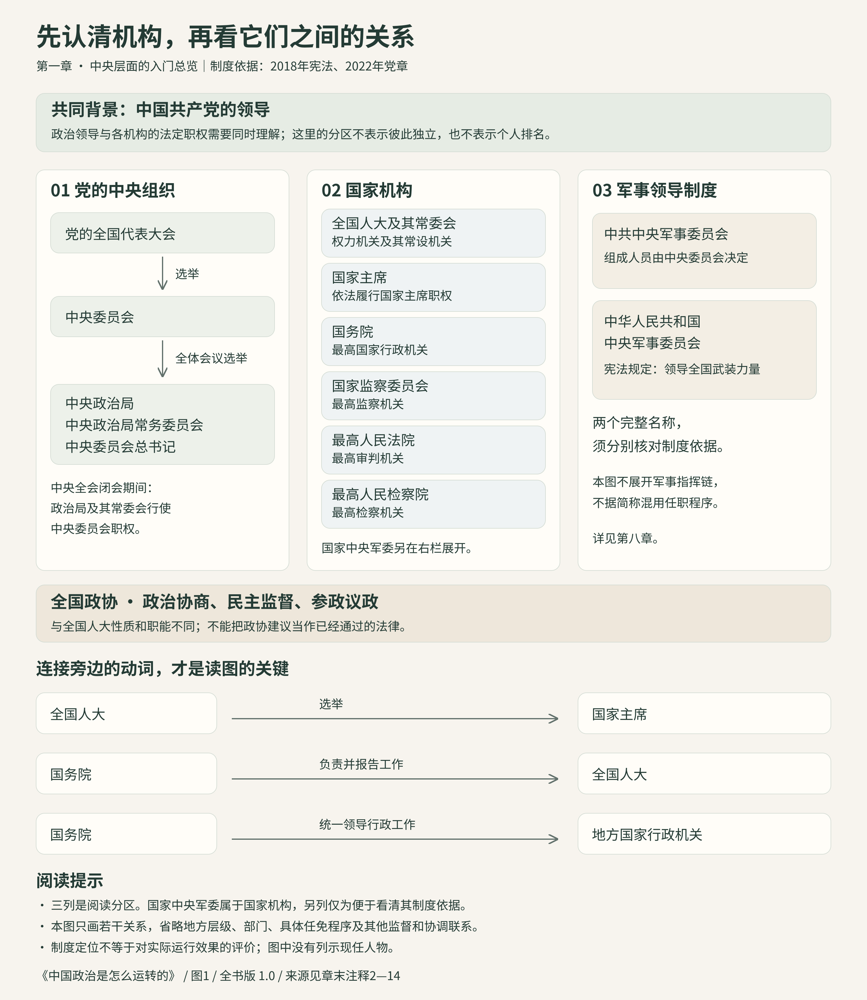

# 第一章　中国到底是谁在治理？

*《中国政治是怎么运转的》· 样章 v0.2*  
*修订与查证日期：2026年9月29日。现实人物依据所引2026年公开报道核对，历史事件另标日期。*

## 名字认识，前面那一长串呢？

2026年8月17日，北京举行纪念江泽民诞辰一百周年大会。习近平发表讲话，李强主持，赵乐际、王沪宁等出席。新华社介绍习近平时，名字前面照例放着三个职务：中共中央总书记、国家主席、中央军委主席。[^1]

这一长串，你大概已经听得很熟了。熟悉到播音员刚念出开头，大脑就自动跳到了名字：知道了，习近平。

至于前面为什么有三个头衔，先略过。

但如果今天不略过呢？同一个人，为什么需要三个职务？是同一个职位换了三种叫法，还是在三套制度安排里分别担任职务？旁边的李强、赵乐际、王沪宁，又各自负责什么？

你原本只是想认识几个人，结果得到了一张没有说明书的组织图。

不妨拿出一张纸。最上面写“习近平——国家主席”，下面写“李强——国务院总理”，再往下写部长、省长、市长。像不像公司里的董事长、总经理和部门负责人？至少看起来很整齐。

然后，赵乐际来了。

他的职务是全国人大常委会委员长。该放在总理上面，还是旁边？王沪宁担任全国政协主席，又该坐在哪里？再加上一个“中央政治局常委会”，纸上的问题更明显了：前面写的是几个人的职务，这回却来了一个集体机构。[^15][^16][^17]

先别急着把纸换大。问题可能出在线上。

我们习惯用“谁是谁的上级”理解一个组织。这种问法很有用，但它回答不了所有问题。谁提出人选，谁决定任命，谁负责日常行政，谁讨论重大政治问题，彼此有联系，却不完全是一回事。

**这一章，我们就跟着几个人走一遍：先看他们在哪个位置，再看这些位置怎样联系。**

你不需要一口气背完机构名单。只要读到最后，再看见“习近平”“李强”“赵乐际”“王沪宁”，脑子里不再只有四个名字，而有了几个不同的位置，这张地图就算开始画出来了。

## 先跟李强走到国务院

先从比较容易落到日常生活的一位说起：李强。

本章修订时，国务院总理是李强。就在2026年9月28日，他主持了一次国务院常务会议。公开报道列出的议题，包括宏观政策和有效投资、新污染物治理，以及一项事业单位登记管理条例草案。[^15]

这几个题目放在一起，颇有一种“今天要处理的事情还真不少”的感觉。经济要研究，环境问题要听汇报，公共服务机构的管理也要讨论。

它们可以帮你找到国务院的位置：**这是中央人民政府，国家行政工作的主要组织和管理机构。**教育、民政、公共卫生等事务，也与这套行政系统有关。总理领导国务院工作，各部门按照自己的职责处理相关事务。[^2][^4]

于是，“总理做什么”就比“总理排第几”更容易理解了。你开始关心的是，一项行政事务由谁组织推进，哪些部门参与，需要作出什么决定。

不过，一说“政府”，我们日常的语言习惯又会来捣乱。

有人把办证窗口叫政府，有人把所有公共机构都叫政府，还有人干脆用“政府”代指整个政治体系。聊天时不妨这样说，画图时却得收紧一点：国务院是中央政府，但全国人大、法院、检察院，并不是它下面的几个部门。[^2]

否则，图虽然画得快，往后遇到一条“国务院向全国人大报告工作”的新闻，就得重新擦。

等等，总理为什么还要向另一个机构报告工作？

这时，轮到赵乐际出场了。

## 赵乐际的位置，为什么不能往总理下面一塞？

本章修订时，赵乐际担任全国人大常委会委员长。2026年9月20日，他在北京同澳大利亚联邦议会众议长会谈。报道谈到的内容之一，正是加强立法机构之间的往来。[^16]

看到了吗？同样出现在重要新闻里，他的机构身份与李强不同。

全国人大，全称全国人民代表大会。它要处理立法、有关国家机构领导人员的产生、国家预算审查批准等重要事务；全国人大常委会，则是它的常设机关。这里有一个值得记住的正式名称：全国人大是**最高国家权力机关**。[^3]

“最高国家权力机关”，听起来很大。那么，委员长是不是所有人的日常工作总指挥？

不能这样换算。

一个机构的职权，与一位负责人可以亲自决定什么，并不是同一张清单。全国人大依法审查批准国家预算，不等于委员长每天替财政部门安排支出；常委会依法开展工作，也不能简化成委员长一个人作所有决定。[^3]

我们可以拿钱这件事想一想。一项公共支出，要考虑预算怎样提出、谁来审查批准，也要考虑具体由哪个部门执行、怎样接受监督。“批准可以花这笔钱”，与“把这笔钱按规定用于某件事”，显然不是同一个动作。

现在，李强与赵乐际背后的两个机构就容易分清一些了：国务院承担国家行政工作；全国人大及其常委会依法行使各自职权，国务院要向它们负责并报告工作。[^4]

这还不是一张完整的权力地图，但至少我们不用再纠结：该把赵乐际写在李强上面两厘米，还是右边三厘米？

先弄清职责和关系，位置自然会出来。若一开始就只想排出一列高低，机构的作用反而被挤没了。

## 一次握手，前面有三道程序

把时间倒回2023年3月11日。

人民大会堂里，十四届全国人大一次会议举行第四次全体会议。根据新华社的现场报道，国务院总理人选的表决结果宣布后，李强起身向代表们鞠躬致意，随后与习近平握手。[^18]

如果你当时只看了新闻画面，很容易记住这次握手。但要理解发生了什么，得把画面往前拨一点。

先是习近平以国家主席身份提名国务院总理人选；接着，全国人大经过投票表决，决定李强为国务院总理；再由习近平根据大会决定，签署主席令任命。[^18]

**提名、决定、任命。**三个动作，一起出现在这次就职过程中。

我们刚才在纸上写下的“习近平——李强”，到这里忽然不够用了。两个人之间，不能只画一根“上级—下级”的线，就以为已经解释完了。你还需要把全国人大，以及它在这一程序中的作用放进去。

那份主席令很短。它所表达的关键意思也很明确：任命是根据全国人大会议的决定作出的。[^19]

因此，新闻里“国家主席任命某某”的最后一步，不能替代前面的全部过程。这也解释了国家主席这个职位的一部分工作：公布法律、根据有关决定任免国家工作人员，以及代表国家进行国事活动等。它不是一个把所有机构日常事务统统包办的岗位。[^5][^6]

但到这里，也许你真正想问的问题才刚刚冒出来：为什么提名的是李强？人选之前是怎样酝酿的？有没有别人？谁说过什么？

这些问题值得问，只是那份主席令没有回答它们。公开会议报道能够告诉我们提名之后的若干程序，却不能让我们听见所有没有公开的谈话。

我们不把问题压下去，也不替看不见的会议写台词。先把能够确认的过程讲明白；走到材料没有覆盖的地方，就把未知留在那里。

这一次握手，可以帮助我们认识几个职位之间的联系。它不能独自解释一个人的全部政治经历。

## 习近平的第二个身份，把另一张地图打开了

现在，假如有人问：“明白了。习近平是国家主席，李强是总理，赵乐际负责全国人大常委会。这张图是不是差不多了？”

还差一个最不能略过的部分。

开头介绍习近平时，排在国家主席前面的那个职务是什么？中共中央总书记。

这就把我们带进了中国共产党的组织体系。新闻里常见的“中共中央政治局召开会议”，说的不是国务院换了个会议室；“总书记”也不是“国家主席”换了一种叫法。

中国共产党在整个政治体系中发挥领导作用。要理解重大政治方向如何形成、人事和组织工作怎样展开，必须把党的组织放进地图；只查国家行政部门名录，图会缺掉关键的一层。[^7]

先不急着背定义。想象你翻开一本政治新闻剪报，依次看到“党代会”“中央委员会”“政治局”“政治局常委会”。这些名字彼此相关，但不是一个机构在不同日期使用的四个别名。

党的全国代表大会选举中央委员会，中央委员会全体会议再选举政治局、政治局常委会和总书记。中央全会不是每天举行；在它闭会期间，政治局及其常委会行使中央委员会的职权。[^8]

到这里，习近平的两个身份终于可以分开放了：总书记在党的中央组织中，国家主席在国家机构中。两种职务由同一个人担任，连接就在眼前；但要查职责、任职程序，仍然得分别查。

类似的“一个人出现在不同位置”，也不只发生在习近平身上。

2026年8月17日那篇报道，还以中央政治局常委介绍李强、赵乐际和王沪宁。也就是说，刚才我们沿着李强认识国务院，沿着赵乐际认识全国人大常委会；换到党的组织图上，又会看见他们的名字。[^1]

于是，两张图开始对上了。

这不意味着可以把党的领导压缩为几位领导人的兼职。组织、决策和工作机制都需要继续展开。但对于第一次画图的你，人物的不同职务至少提供了一个看得见的入口。

同样，知道党发挥领导作用，也不能省掉“总理怎样就职”“预算怎样通过”“政策怎样执行”这些问题。方向要通过具体工作变成现实，中间还有很多环节。我们刚刚看过的2023年任命，就是其中一种。

## 三个头衔，并不是同一天一次领齐的

习近平还有第三个常见头衔：中央军委主席。

它听起来离日常生活更远，却不能被挤到纸边上。国家中央军委领导全国武装力量，这与国务院的日常行政工作不是同一条线。[^11]

到这里，我们不妨把镜头再往前拨几个月，看看习近平的几个职位是怎样分别出现在公开记录中的。

2022年10月23日，二十届一中全会公报公布：习近平当选中央委员会总书记，同时公布他担任中共中央军委主席。[^9]

到了2023年3月10日，全国人大会议又选举习近平为中华人民共和国主席、中华人民共和国中央军事委员会主席。[^10]

如果只盯着名字，很容易纳闷：怎么前一年已经有了结果，第二年还要再来一次？

因为前后说的，并不是同一组职务。

| 时间 | 发生了什么 | 你应当留意的区别 |
|---|---|---|
| 2022年10月23日 | 二十届一中全会选举总书记，决定党的中央军委组成人员 | 这是党内的中央组织程序 |
| 2023年3月10日 | 全国人大选举国家主席、国家中央军委主席 | 这是国家机构的产生程序 |

这还藏着一个容易忽略的小细节。平时新闻里的“中央军委”，展开后可能指中共中央军事委员会，也可能指中华人民共和国中央军事委员会。看起来只多了几个字，查任职程序时却不能省。[^11]

不是让你现在就把所有军事机构背下来，而是先留个心眼：读人事新闻，要看完整职位。更不要凭“国防部”这个名字，便把全国军队顺手画成国务院某个部门下面的一条支线。

军队的领导体系，我们在第八章专门展开。本章先让习近平的三个常见身份各自有位置：党的中央组织、国家主席制度、军事领导制度。

同一个人把它们联系起来，不等于它们从此成了一个职位。

## 王沪宁为什么也有一场“会”？

还有一个开篇就出场、现在该介绍的人：王沪宁。

本章修订时，他担任全国政协主席。2026年9月24日，王沪宁主持全国政协主席会议，会议涉及组织委员围绕产业、农业、教育等问题建言献策，当天还安排了以高等教育为主题的集体学习。[^17]

听到产业、农业、教育，你可能又想起李强那场国务院常务会议：话题好像有重合，为什么还要另开一场？

因为关心同一件事，不等于以同一种方式处理它。

一所学校怎样办好，政府部门需要履行管理职责；政协委员也可以调研、讨论，把意见和建议送到有关方面。但委员提出建议，与行政部门作出决定，并不是同一个动作。

全国政协所在的人民政协，是统一战线组织，也是中国共产党领导的多党合作和政治协商的重要机构。它的主要职能是政治协商、民主监督、参政议政。先把这些词翻译成读新闻时能用的话：围绕公共事务协商讨论、反映意见、提出建议和批评。[^13]

这就能解开“两会”的一层困惑。全国人大和全国政协经常一起进入新闻，并不意味着它们是两个功能相同的立法机构。

同样叫“会议通过”，还得问一句：通过的是什么？是法律，是本机构的一项工作安排，还是准备送往有关方面的建议？只看“通过”两个字，可判断不出来。

以后看见“政协委员建议……”的新闻，也别急着当成“明天开始全国实行”。建议要不要采纳、怎样转成政策，需要继续往下看。[^13]

到这里，李强、赵乐际、王沪宁就不再是一串需要硬背的名字了。国务院、全国人大常委会、全国政协，分别在他们身后清楚了一点。

## 还有三位，先认识名字，别混淆工作

假如以后你看到一个官员被调查的新闻，这张图还需要三块地方：监察机关、检察机关、法院。

本章修订时，国家监委主任是刘金国，最高人民法院院长是张军，最高人民检察院检察长是应勇。相关身份分别见本章所引2026年公开报道。[^20][^21][^22]

现在不用急着背他们的履历。先记住一个容易发生的误会：新闻里说“调查”，不等于已经“判决”；检察机关采取某项行动，也不能写成法院已经作了决定。

监察委员会是国家监察机关，法院负责审判，检察院是国家法律监督机关。三种身份，需要分开放。[^12]

这一章不把整个案件程序提前塞给你。等到第七章与第十四章，我们会顺着具体事件，看各类机关在哪一步出现。到那时，再回头看今天认识的几个名字，它们就不只是新闻中的称呼。

先给他们留好位置。地图最有用的地方，就是遇到新信息时有地方可放，不必每次推倒重来。

## 图终于可以画了，但线要慢一点

*图1：机构关系简图。布局不是个人政治排名；现任人物见正文及下表。图中省略部门、地方层级及大量程序，详细依据见注2—14。*

| 本章现实坐标 | 人物 | 本次使用的2026年资料 |
|---|---|---|
| 中共中央总书记、国家主席、中央军委主席 | 习近平 | 8月17日活动报道，注1 |
| 国务院总理 | 李强 | 9月28日国务院常务会议，注15 |
| 全国人大常委会委员长 | 赵乐际 | 9月20日会谈报道，注16 |
| 全国政协主席 | 王沪宁 | 9月24日主席会议，注17 |
| 国家监委主任 | 刘金国 | 8月26日活动、9月10日转载，注20 |
| 最高人民法院院长 | 张军 | 9月14日刊发的活动报道，注21 |
| 最高人民检察院检察长 | 应勇 | 9月15日活动、9月16日报道，注22 |

*整理核验日：2026年9月29日。此表是本章人物速查，不是完整领导名录；表中注明各条证据的实际日期。*

现在，你终于可以重新拿起笔。不过，每画一根线，最好先问一句：这根线是什么意思？

全国人大选举国家主席，是职务怎样产生的问题；国务院向全国人大负责并报告工作，是责任关系；国务院统一领导地方国家行政机关的工作，又是行政领导关系。[^14]

如果这些都画成同一种没有说明的箭头，最后会出现一张整整齐齐、却让人越看越糊涂的图。

人物之间也一样。一起出席活动、曾在同一个地方工作、担任相关职务，各自能说明的事情不同。不能因为两个人的名字在报道里挨得近，就替他们添上一段没有证据的关系。

图可以帮助你思考，不能替你制造事实。

## 再回到那场大会

现在重读2026年8月17日的新闻。

习近平发表讲话，李强主持，赵乐际、王沪宁等出席。同样几个人，第一次读的时候可能只觉得“来了不少领导”，现在已经能多看出几层意思。

习近平名字前面的三个职务，你知道为什么要分开。李强让你想到国务院；赵乐际让你想到全国人大常委会；王沪宁则通向全国政协。报道又把他们放进党的中央领导机构的背景里，两张地图开始在你脑中联系起来。

但你仍然不知道，他们在某次没有公开记录的讨论中各自说过什么。

这里就停一下。认识机构，不会自动让人拥有读心术。公开事实能把我们带到哪里，就先走到哪里；再往前，需要新的证据。

这并不妨碍我们把问题问得更好了。

开篇的问题是：“国家主席下面都有谁？”现在，你已经可以换成几个更具体的问题：这个人有哪些职务？眼前这件事涉及哪一个身份？由谁提名、谁决定、谁执行？新闻告诉了我哪一步，还有哪一步没告诉我？

名字还是那些名字，新闻也还是那条新闻。只是这一次，你终于知道从哪里读起。

下一章，我们把两张地图叠得更近一些：党委与政府，究竟怎样发生联系？

## 合上这一章，试试看

1. 习近平同时担任几个重要职务，为什么仍然需要分别理解？
2. 看到李强、赵乐际、王沪宁，你现在能各自联想到哪个机构？这些机构做的事情有什么不同？
3. 读到“某位政协委员提出建议”，能不能直接理解为新政策已经生效？

**再看一次真实事件：**2023年3月11日，李强出任国务院总理。从国家主席提名，到全国人大决定人选，再到主席令任命，分别是谁作了什么？如果朋友说“看主席令就能知道此前所有的人事讨论”，你会怎样回答？[^18][^19]

### 参考答案

第一题：同一个人可以担任不同职务，但各职务的职责、所属制度与产生程序不同，不能只用其中一个头衔解释其全部政治作用。

第二题：李强——国务院，承担国家行政工作；赵乐际——全国人大常委会，是全国人大的常设机关，依法履行相应立法、监督等职权；王沪宁——全国政协，履行政治协商、民主监督、参政议政等职能。注意区分机构职权与负责人个人职责。

第三题：不能。提出建议与作出具有相应效力的决定是不同环节，还要继续查是否采纳、由谁作出决定、公布了什么文件以及何时生效。

应用题：习近平以国家主席身份提名，全国人大决定人选，习近平根据大会决定签署主席令任命。主席令记录正式任命，不能独自证明此前所有酝酿讨论的内容。

## 注释与继续阅读

以下链接是本章使用的制度文本或报道。阅读时先看注释指定条款，不需要一次读完全部文件。党章负责解释党内制度，宪法负责解释相关国家制度；新闻只支持其明确报道的事实。

[^1]: 新华社：《纪念江泽民同志诞辰100周年大会在京隆重举行　习近平发表重要讲话》，2026年8月17日。核对报道的开头、职务介绍与活动举办机构。本章不以此确认整份中央领导名录。[报道原文](https://www.news.cn/politics/leaders/20260817/c09eaee334464122a24e6a6b67e756a3/c.html)。资料编号S003。

[^2]: 《中华人民共和国宪法》，2018年修正文本，第三章“国家机构”，尤其第八十五条。[商务部转载全文](https://www.mofcom.gov.cn/xxgcxjpxsdzgtsshzysx/zywj/art/2018/art_45c1e16fe351469090d53e63178268c8.html)。资料编号S001。下列宪法注释均指向同一文本，不构成多来源交叉验证。

[^3]: 同上，第五十七、五十八、六十二条。全国人大与其常委会的具体职权分配见第三章第一节；本章只介绍入门所需内容。

[^4]: 同上，第八十五至八十九条、第九十二条。有关行政事务的生活化表述为作者解释，不是穷尽列举。

[^5]: 同上，第七十九至八十一条。尤其注意第八十条中任免行为与人大及其常委会决定之间的关系。

[^6]: 同上，第六十二条第五项、第八十条。总理、副总理、部长等职务的提名和决定程序并不完全一样，本章只以总理为例。

[^7]: 宪法第一条；《中国共产党章程》，2022年10月22日通过的修改文本，总纲最后一段。[党章全文](https://www.12371.cn/special/zggcdzc/zggcdzcqw/?jump=true)。资料编号S002。本章依据正式文本解释制度定位，尚不据此评价各领域实际运行效果。

[^8]: 党章第十九至二十三条。有关中央组织的详细关系、会议和职务，见本书第3章。

[^9]: 《中国共产党第二十届中央委员会第一次全体会议公报》，2022年10月23日，新华社发布，北京市政府网站转载。参见程序说明及第三、第五项。[公报全文](https://www.beijing.gov.cn/ywdt/yaowen/202210/t20221023_2841775.html)。资料编号S004。公报中的完整人名表属于2022年当时记录，本章没有将其用作2026年现任表。

[^10]: 《习近平全票当选为国家主席中央军委主席》，2023年3月10日，司法部网站转载新华网图片新闻，图片说明列明会议、日期及职务。[消息原文](https://www.moj.gov.cn/gwxw/tpxw/202303/t20230310_473854.html)。资料编号S005。本章只使用当选职务与日期，不对投票过程作超出该消息的描述。

[^11]: 党章第二十三条；宪法第六十二条第六项、第九十三、九十四条。这里只区分两种完整名称与制度依据，不展开军委组织沿革和军事指挥链。

[^12]: 宪法第一百二十三、一百二十五、一百二十八、一百三十二、一百三十四、一百三十七条。调查和诉讼程序将在相应章节依据具体法律另行核验。

[^13]: 《中国人民政治协商会议章程》，2023年3月11日修订，总纲与第三条；北京市通州区政协网站2023年5月5日转载。[已核对的章程全文](https://zhengxie.bjtzh.gov.cn/bjtzhzx/zxgk/zxzc/index.shtml)。资料编号S008。全国政协网站原页面本次直接访问失败，改用这一官方转载核对原文；正文中的性质与职能均可定位至上述条款。

[^14]: 宪法第七十九条、第八十九条第四项、第九十二条，以及党章总纲。本章将关系分为几种，是教学上的拆解，不能看作完整的法律分类体系。

[^15]: 新华社2026年9月28日电：《李强主持召开国务院常务会议　研究宏观政策发力提效、促进有效投资有关工作等》，辽宁省政府网站9月29日转载。[报道全文](https://www.ln.gov.cn/web/ywdt/rdgz/2026092909033649918/index.shtml)。S009；核对开头职务与议题。正文不据会议研究事项声称相关措施均已生效。

[^16]: 新华社：《赵乐际同澳大利亚联邦议会众议长迪克会谈》，2026年9月20日。[报道全文](https://www.xinhuanet.com/politics/leaders/20260920/3573ed199e184209a603c11dec72fc88/c.html)。S010；核对赵乐际职务及立法机构交往内容。

[^17]: 新华社：《王沪宁主持召开全国政协主席会议》，2026年9月24日。[报道全文](https://www3.xinhuanet.com/politics/leaders/20260924/02fcb42c590f4cf7b16abacda2dd25d2/c.html)。S011；核对王沪宁职务、建言议题及高等教育主题学习。不将这次主席会议称为全国政协全体会议。

[^18]: 新华社2023年3月11日电：《十四届全国人大一次会议举行第四次全体会议……》，国务院台办网站3月13日转载。[报道全文](https://www.gwytb.gov.cn/topone/202303/t20230313_12517690.htm)。S012；核对总理产生程序、结果宣布后起身致意和握手。正文未补写现场人物心理。该材料用于历史事件，不用于2026年现任核验。

[^19]: 《中华人民共和国主席令（第一号）》，2023年3月11日，北京市人大常委会网站转载。[主席令原文](https://www.bjrd.gov.cn/zyfb/zt/14jqgrd01chybjdbthdztbd/dhyw/202303/t20230312_2934494.html)。S013；与注18同属这一任命的公开资料，分别提供会议过程与正式文本。

[^20]: 中央纪委国家监委网站：《中国共产党中央纪委国家监委机关第二次党员代表大会召开　刘金国出席会议并讲话》，活动日期2026年8月26日，地方纪委监委网站9月10日转载。[已核对的转载全文](https://www.pdsjjw.gov.cn/sitesources/zksjjjcw/page_pc/xsqjw/lyx/ywyl/article4806ee6c1acf42fc89eab0bcd5e3cad7.html)。S014；只使用刘金国的国家监委主任身份，不把转载日期写成活动日期。

[^21]: 西安交通大学新闻网：《单文华教授续聘最高人民法院国际商事专家委员会专家委员并主持大会议题研讨》，2026年9月14日。[活动报道](https://news.xjtu.edu.cn/info/1219/234737.htm)。S015；参会者所在大学法学院供稿，正文明确张军的最高人民法院院长身份。页面正文写“近日”，本章不依据搜索摘要为该活动指定具体日。

[^22]: 最高人民检察院：《应勇到检察日报社调研》，宁夏检察机关网站2026年9月16日转载，活动日期9月15日。[报道全文](https://nx.jcy.gov.cn/QJCY/njttxw/202609/t20260916_1157814.html)。S016；核对应勇的最高人民检察院检察长身份。
