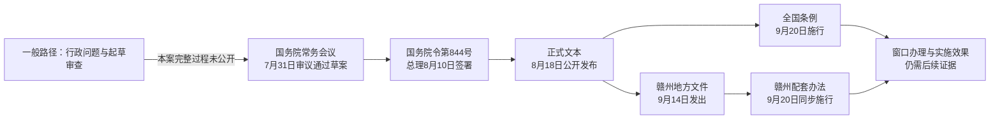

# 第五章　国务院怎样处理日常行政？

*《中国政治是怎么运转的》· 修订稿 v0.2*  
*事实核查日期：2026年9月29日。现任人物按所引2026年公开活动核对；会议、签署、发布、施行分别标出日期。*

## 会议通过了，明天就能去提取吗？

2026年7月31日，李强主持国务院常务会议。当天的新华社报道列出一张看起来不太像同一张桌子上的议程表：经济工作、新型电网和物流网、健康优先发展、核电项目，还有修改《住房公积金管理条例》的决定草案。关于公积金，报道说会议“审议通过”草案，并提出要拓宽提取和使用范围、扩大制度覆盖面。[^1]

如果你正在租房，或想用公积金装修自住住房，最想问的恐怕不是这场会排第几次，而是：现在能办了吗？

只看7月31日的新闻，还不能回答“明天就能办”。因为新闻里的宾语是**草案**。它告诉我们国务院常务会议已经处理了这项修改，却没有给出正式公布的法规文本、施行日期，更没有说明你所在城市的申请材料和窗口流程。

随后，另一份文件出现了。国务院第844号令写明，修改决定经7月31日国务院第93次常务会议通过，由总理李强于8月10日签署，9月20日起施行。新华社于8月18日发布相关消息和文本。会议通过、总理签署、对外发布、正式施行是四种动作，不能因为它们都写在同一份报道里，就把它们压成同一天。[^2]

这中间究竟谁做了什么？我们不需要猜会议室里的发言。沿着公开的制度和文件，已经可以把国务院的日常工作看得相当清楚：谁把问题送上桌，谁参与讨论，谁把结论变成正式文本，谁负责此后的执行。

第一章介绍过，国务院是中央人民政府。第二章也分清了政府党组会议与政府常务会议。本章从这张桌子内部往外走：**国务院不是总理一个人加一圈部长；它要用分工、会议、文件和部门协作，让行政决定真正进入工作。**[^3]

## 总理负责，为什么还要开会？

李强主持会议，是因为总理领导国务院工作，并召集、主持国务院全体会议和常务会议。《国务院组织法》同时规定，国务院工作中的重大问题必须经常务会议或者全体会议讨论决定。一个是负责制，一个是重大问题的讨论制度，它们并不互相抵消。[^3]

这也解释了7月31日新闻为什么会把一份条例草案写进会议议程。国务院常务会议的法定任务之一，就是审议行政法规草案；它也讨论、决定、通报国务院工作中的重要事项。当天同一场会“听取”建设情况汇报、“研究”健康战略、“审议通过”两份草案、“决定核准”核电项目。几个动词不是新闻编辑为了避免重复换的说法，它们指向不同种类的事项和不同的后续程序。[^1][^3]

常务会议由哪些人组成？法律列出总理、副总理、国务委员和秘书长。各部部长并不是这个会议的当然成员；《国务院工作规则》允许根据议题安排有关部门和单位负责人列席。列席某个议题，与成为常务会议的组成成员，不能画等号。[^3][^4]

再把镜头稍稍移到李强旁边。2026年9月8日，国务院的一次专题学习公开报道中，副总理丁薛祥和国务委员吴政隆作了交流发言。这条报道可以核对他们当时的身份，却不能证明他们在7月31日的公积金议题中各说了什么；那次会议的公开报道没有披露逐人发言。[^5]

“副总理”和“国务委员”听起来像一串高低座次，但在日常行政里更值得问的是分工。《国务院组织法》规定，两类职务都协助总理，按分工负责分管领域；受总理委托，也可以负责其他方面工作或专项任务。这不是说每位副总理都能替所有部长作决定，也不是说国务委员只能管一件事。具体遇到一项事务，应查公开分工和该事项的正式文件，不能凭新闻里的名字顺序给它指定负责人。[^3]

吴政隆还有一个与本章特别相关的职务：国务院秘书长。2026年3月全国人大会议报道仍称他为“国务委员兼国务院秘书长”。法律规定，秘书长在总理领导下处理国务院日常工作，并领导国务院办公厅。这样，秘书长这个职位就不是会议名单末尾的附带头衔：议程、文件和部门之间的衔接，都需要日常工作机构支撑。这里讲的是法定岗位，不是说吴政隆本人经手过本案哪份未公开材料。[^3][^6]

如果总理负责制只被理解成“总理拍板，所有人等着”，我们就看不到副总理、国务委员和秘书长为何存在；如果只看见集体开会，又会忘记总理领导国务院、签署行政法规的责任。把两边同时放进画面，7月31日那场会议才有了基本轮廓。

## 一份草案怎样找到会议桌？

会议报道从“审议通过”开始讲，工作却不可能从主持人宣布开会才开始。《国务院工作规则》规定，提请国务院全体会议和常务会议讨论的议题，由总理或国务院分管领导提出，国务院办公厅按程序报总理确定；会议的组织工作由办公厅负责，议题和文件会前送达与会人员。一般事项还要先由有关部门协调，不能把尚未处理的部门分歧简单地扔到会上。[^4]

国务院办公厅的作用因此比“订会议室”大得多。它协助处理国务院日常工作，审核报国务院审批的公文，按照领导同志的分工呈批；涉及多个部门时，还要保证文件确实走到了该到的地方。办公厅不是所有政策的作者，也不是另一个替国务院作决定的机构。把它放在流程里，主要是看见行政机器怎样保持运转。[^4]

公积金修改属于行政法规修改。这一次，公开文件已经告诉我们谁承担起草任务：国务院2026年度立法工作计划附件把修订《住房公积金管理条例》列为拟完成审查的行政法规项目，起草部门是住房城乡建设部。再往后，还有一套较详细的程序。2026年7月1日起施行的《行政法规制定程序条例》规定，行政法规由国务院组织起草，可以由一个或几个部门具体起草，也可以由国务院法治部门起草或组织起草。起草应听取意见；涉及其他部门职责的，要协商。送审稿报到国务院后，由国务院法治部门审查，必要时再协调分歧、征求意见，形成提交审议的草案。[^7][^8]

这里要停一下：起草任务归住房城乡建设部，是公开计划可以确认的；实际有哪些单位和人员参加起草、怎样协调意见、改过多少稿，公开材料没有完整披露。7月31日会议报道和第844号令又确证了草案经会议审议通过、总理签署、施行日期等节点。知道一段，不等于知道全程。制度说明不能伪装成已公开的会议纪要。[^1][^2][^7][^8]

为什么会有这些协调要求？翻开2026年修订后的公积金条例就明白了。住房城乡建设主管部门与公积金管理有关，财政部门涉及财务监督，中国人民银行和银行业监督管理机构也出现在相关条文里；新条文还把一些地方办理事项交给住房公积金管理委员会、管理中心和地方政府。只让某一个部门关起门来写完并执行，显然解释不了这些职责怎样衔接。[^2]

例如，新的第四十九条说，个体工商户、非全日制从业人员及其他灵活就业人员可以自愿缴存，按规定享受支持；具体办法由设区的市级以上地方人民政府制定，国务院住房城乡建设主管部门等有关部门加强指导。这一条同时指出了中央规则、部门指导与地方办法的不同位置。它并没有把全国每个城市的缴存额度、申请材料和窗口步骤写成同一张表。[^2]

你也许会想：住房城乡建设部承担起草任务，国务院法治部门负责审查，是否就等于某一位部长决定全部内容？不能这样推。起草和审查是机关职责，国务院常务会议和总理还有各自的决定、签署环节。把这些工作位置看清，比猜某位官员的个人态度更有用。[^7][^8]

## 部、总局、办公厅：为什么不是一排同样的“部门”？

这件事牵出另一个常见误会。听见“住建部”“财政部”“金融监管总局”，我们容易把它们统称为国务院部门，然后以为组织关系与权限也完全相同。

住房和城乡建设部是国务院**组成部门**。2026年9月20日的公开活动报道仍以住房城乡建设部部长介绍倪虹；这可以确认本章写作时的现任身份。依《国务院组织法》，组成部门负责人领导本部门工作，在职权范围内处理业务，也要就重大方针、政策、计划和行政措施向国务院请示报告。部长管理一条业务线，不等于全国所有涉及住房的决定都由部长个人作出。[^3][^9]

国务院还有直属机构、办事机构等类别。2023年公开的机构设置通知把国家市场监督管理总局、国家金融监督管理总局等列为直属机构，把国务院研究室列为办事机构；国务院国有资产监督管理委员会另列为直属特设机构。名称里有“总局”，并不自动意味着它是组成部门；名称里有“委员会”，也不一定就是与部同一类。要看正式机构名录和职责。[^10]

《国务院行政机构设置和编制管理条例》给了一个简明区别：组成部门分别履行国务院基本的行政管理职能；直属机构主管某项专门业务，具有独立行政管理职能；办事机构协助总理办理专门事项，本身不具有独立行政管理职能。国务院办公厅则协助国务院领导处理日常工作。实际机构会调整，所以类别仍应按有效的机构设置文件核对。[^11]

这种分类对普通人有什么用？它防止我们把“国家金融监督管理总局参与公积金相关监督”误读成“住建部下属的一个局来办贷款”，也防止我们以为“国务院研究室”会像业务主管部门那样直接对公积金窗口发规章。不同机构会碰到同一件事，权限来自各自的制度位置。[^2][^10][^11]

更关键的是，行政工作经常跨界。修订后的公积金条例规定，住房公积金财务管理和会计核算办法由国务院财政部门商国务院住房城乡建设主管部门制定；监督部分分别提到住房城乡建设、财政、审计、人民银行等方面。这里的“商”不是客套字，它提示读者：一个文件落地时，负责起草、提供专业意见、监督实施的机关可能不同。[^2]

国务院工作规则也为分歧设置了路径。部门之间对报国务院审批的公文有分歧时，分管主办部门的国务院领导同志牵头协调，国务院副秘书长协助；办公厅再按分工呈批，重大事项报总理审批。公开规则能告诉我们矛盾如何应当处理，却不能让我们凭结果推断本案曾经发生何种分歧。[^4]

## 文件签了，为什么还要看日期？

回到那份第844号令。它开头写“已经2026年7月31日国务院第93次常务会议通过”，落款是“总理李强，2026年8月10日”，并写明“自2026年9月20日起施行”。从“草案”到正式法规的关键桥梁，就在这里。[^2]

2026年施行的《行政法规制定程序条例》规定，国务院法治部门应根据审议意见修改草案，报请总理签署国务院令公布施行，国务院令载明施行日期。国务院组织法也规定，国务院发布的行政法规由总理签署。这些条文解释了签署在制度链条中的位置。但它们不提供本案最终修改了几稿的记录；我们也不能把“签署”写成总理独自起草全部条款。[^3][^7]

公布之后，读者才能拿到准确的条文。会议新闻只说“拓宽提取和使用范围”，正式文本则把可提取情形写具体：支付房租、购买或修建自住住房、偿还购房贷款本息，以及装修自住住房、支付自住住房物业费等。它还规定了申请和管理机构的责任。若要判断某项权利或义务，正式条文比会议概括更可靠。[^1][^2]

不过，条例9月20日开始施行，也不意味着你在任何城市、任何窗口、凭会议新闻就一定能办成。条例有全国适用的规则，有些事项还要求地方制定具体办法。申请条件、材料和办理路径，应继续看当地公积金管理机构依据新条例发布的有效规定；某地实施进度，也要用当地信息核验。**条例开始施行，与每一次具体办理已经完成，是两种事实。**[^2]

我们可以看到一段地方接续。赣州市住房公积金管理委员会9月14日发文，修改本市公积金提取、贷款、归集办法中的若干表述和规定，并明确9月20日与新修订的国务院条例同步施行。比如，把旧有贷款利率依据调整为“国务院决定的贷款利率标准”，又在贷款办法中增加管理中心受理申请后十日内作出是否准予贷款决定的要求。读者拿到这份地方文件，才看得见全国法规如何进入某个城市的具体规则。[^12]

这仍不能证明赣州每个申请已经办妥，也不能代表全国所有城市采取一样的细则。文件展示的是**规则接上了**；要评价办理速度、服务体验或政策效果，还得找后来实际执行的资料。

## 一部旧条例，为什么在2026年要改？

《住房公积金管理条例》不是2026年凭空出现的。它最初于1999年公布，2002年和2019年修订，2026年作第三次修订。这个小小的年份列表，提醒我们行政制度也有历史：旧条文回答当时的问题，后来住房消费、就业方式和监管要求变化，文本便可能跟着调整。[^2]

看一个变化就够了。新的条文明确让个体工商户、非全日制从业人员及其他灵活就业人员可以**自愿缴存**，由设区的市级以上地方政府制定具体办法。司法部与有关部门的解读把这项变化放在此前灵活就业人员参加住房公积金制度试点的背景下解释。这里可以说“试点经验进入法规设计”；不能仅据解读断言每个地方的新办法已经完成，或所有灵活就业者已经实际获得贷款。[^2][^13]

为什么特意提过去的版本？因为用今天的规则去解释1999年的行政工作，会出错。2026年7月1日起施行的《行政法规制定程序条例》，可以说明本章所写审议、签署阶段有效的制度规则；年度立法计划5月已经列出修订任务，更早的起草过程不能由7月生效的新规则替我们复原。它当然也不能解释1999年第一次公布时每一步如何走。本章只借同一部条例看到：国务院处理日常行政，不只是每天发布新文件，还包括在已有制度上修改、衔接和监督落实。[^2][^7][^8]

把本章各段放进一条可追踪的线，事情就清楚了：

图的第一格写的是行政法规的一般工作阶段，本案公开材料没有还原其全部内部过程。8月18日公开文本后，赣州在9月14日发出地方文件，并与全国条例在9月20日同步施行。这个例子不替代对其他城市的调查。最后一格故意没有填“完成”：文件的生命到这里才进入人们日常办事的现场。[^1][^2][^7][^12]

## 读国务院新闻，先找动词，再找文件

国务院常务会议通稿往往很短，一次塞进好几项事务。有人读完觉得：总理什么都管，部委只是等命令。有人读完又觉得：既然部委有职责，会议大概只是走个形式。两种想法都无法解释这份公积金文件为什么有会议、签署、施行和地方配套这些不同节点。

更稳妥的读法，是沿着工作问四句：会议**做了什么动作**？动作的对象是草案、汇报、项目，还是正式决定？下一份应寻找的文件是什么？谁按条文负责执行，哪些结果尚未出现？

问到这里，总理、副总理、国务委员、秘书长、部长和其他机构都不再只是名片上的头衔。总理领导国务院并签署行政法规；副总理和国务委员按分工协助；秘书长和办公厅组织日常衔接；组成部门处理本领域工作；有独立行政管理职能的直属机构按职责参加；办事机构承担专门辅助工作。跨部门时，要协商、协调、审查。最后还要靠具体机关把正式规则用起来。[^3][^4][^10][^11]

这些是制度上的位置，不能从它们反推出每个人在本案所有会议里的言行。公开证据能把链条画出来，却不能填满每一个格子。少填几格，反而能让已经知道的部分更可信。

## 新闻重读：同一场会，四个动词

再读2026年7月31日的新华社报道：李强主持国务院常务会议，会议**听取**新型电网、物流网建设情况汇报，**研究**健康优先发展战略实施，**审议通过**修改《住房公积金管理条例》的决定草案，**决定核准**四个核电项目。[^1]

试着回答：

1. 仅凭这篇报道，能否说8月1日起全国都可以按新公积金条例办理装修提取？
2. 要确认公积金修改何时正式施行、由谁签署，应找哪份文件？
3. “听取汇报”“研究”“审议通过草案”“决定核准”可不可以统统改写成“政策已全部实施”？
4. 如果读者在某个城市办理灵活就业人员自愿缴存，还要查哪一级的规则？

**参考解释**

第一题，不能。7月31日报道的是草案经会议审议通过。第844号国务院令后来明确9月20日起施行；具体业务还要看正式条文规定的条件和当地有效的办理要求。无论如何，不能据此宣布某人8月1日就能办好装修提取。[^1][^2]

第二题，找正式发布的第844号国务院令和重新公布的条例。令文载明7月31日会议通过、李强8月10日签署、9月20日施行，日期各有作用。[^2]

第三题，不可以。它们记录会议处理了不同类型的事项；后续文件、建设进度和实际效果要分别核查。核电项目“核准”也不是“已经建成发电”。[^1]

第四题，先读全国条例的新第四十九条，再查所在地设区的市级以上地方政府及公积金管理机构有效的具体办法和办理指南。赣州文件只说明赣州已经调整了部分规定，不能替别的城市回答。[^2][^12]

这样重读，一场会不再是一句“中央已经决定”。它是一串可以继续追问、继续找证据的行政动作。

---

## 注释与资料

[^1]: 新华社，[《李强主持召开国务院常务会议》](https://whlyj.beijing.gov.cn/zwgk/xwzx/gwyxx/202608/t20260803_4805496.html)，2026年7月31日，见会议议题及关于公积金的段落。链接为北京市文化和旅游局转载新华社电，事件日和电讯日期均为7月31日。会议报道用语为“审议通过……决定（草案）”；正文不据此推定正式法规当日已施行。

[^2]: 国务院第844号令及重新公布的[《住房公积金管理条例》](https://www.gov.cn/zhengce/content/202608/content_7078477.htm)，国务院令署名日期2026年8月10日，新华社8月18日发布；另可核对司法部智慧普法平台[公布文本](https://legalinfo.moj.gov.cn/zhfxfzzx/fzzxyw/202608/t20260819_538654.html)，2026年8月19日刊载。令文载明7月31日国务院第93次常务会议通过、9月20日施行；修订后条例第五至十条、第二十四条、第四十八至四十九条及有关监督条文用于正文举例。公布网页日期、签署日期、施行日期不可混写。

[^3]: [《中华人民共和国国务院组织法》](https://www.mee.gov.cn/zcwj/gwywj/202403/t20240312_1068167.shtml)，2024年3月11日修订、公布施行，第二条、第五至十条、第十二至十四条、第十九条；生态环境部转载中国政府网、新华社公布文本。副总理与国务委员的分工属于法定岗位职责，正文不据此指定本案的实际分管人。

[^4]: 国务院[《国务院工作规则》](https://app.www.gov.cn/govdata/gov/202303/24/498225/article.html)，2023年3月17日国务院第一次全体会议通过，印发通知落款3月18日，所引中国政府网页面3月24日刊载，重点见第五、七、十七至二十三、二十九至三十、三十四至三十六项；本文据公开规则归纳议题确定、列席、办公厅组织、公文协调和落实程序，不把规则当成2026年7月31日会议的逐项办理记录。

[^5]: 新华社，[《李强主持国务院第二十一次专题学习》](https://www.ln.gov.cn/web/ywdt/rdgz/2026090909040843951/index.shtml)，2026年9月8日活动、9月9日辽宁省政府网站转载。报道可核对丁薛祥的国务院副总理身份、吴政隆的国务委员身份及两人作交流发言；这里只用于核对2026年身份，不关联他们与7月31日条例草案的未公开分工。

[^6]: 新华社，[《中共中央、全国人大常委会、国务院等领导同志分别参加十四届全国人大四次会议代表团分组审议》](https://www.ln.gov.cn/web/qmzx/2026qglh/hydt/2026030608561487955/index.shtml)，2026年3月，称吴政隆为国务委员兼国务院秘书长；国务院组织法第十条规定秘书长职责及对办公厅的领导，链接见注3。

[^7]: 国务院第838号令[《行政法规制定程序条例》](https://legalinfo.moj.gov.cn/zhfxfzzx/fzzxyw/202605/t20260520_535253.html)，2026年5月15日签署，7月1日起施行，重点见第十六至二十三条、第二十八至三十五条、第四十五条。该条例适用于行政法规修改程序；正文用它说明本章审议、签署时有效的一般制度规则，不以其复原7月1日前的实际起草过程，也不倒用于1999年。

[^8]: 司法部发布的[《国务院2026年度立法工作计划》](https://www.moj.gov.cn/pub/sfbgw/jgsz/jgszjgtj/jgtjfzdyj/fzdyjtjxw/202605/t20260518_535138.html)，2026年5月18日；附件“拟完成审查的行政法规项目”第21项列明《住房公积金管理条例（修订）》由住房城乡建设部起草。该文件确认公开计划中的任务分工，不足以还原实际参与人员、部门会签名单和意见协调全过程。

[^9]: [《2026年世界清洁日全球主场活动在绍兴开幕　倪虹致辞》](https://www.tba.gov.cn/slbthlyglj/lyss/content/678361ae-5a51-4333-b08c-9f9328156cc0.html)，2026年9月20日活动，报道明确倪虹为住房城乡建设部部长；组成部门负责人职责见注3。该活动只用于核对现任身份，不作为公积金修订参与证据。

[^10]: 国务院[《关于机构设置的通知》](https://app.www.gov.cn/govdata/gov/202303/20/498124/article.html)，国发〔2023〕5号，2023年3月16日，2023年3月20日中国政府网刊载。本文只列举与机构类别有关的几个名称，未把2023年名录当成2026年所有人员的现任名单。

[^11]: [《国务院行政机构设置和编制管理条例》](https://xzfg.moj.gov.cn/front/law/detail?LawID=488&Query=%E5%9B%BD%E5%8A%A1%E9%99%A2%E6%9C%BA%E6%9E%84%E8%AE%BE%E7%BD%AE%E7%BC%96%E5%88%B6%E6%9D%A1%E4%BE%8B)，国家行政法规库，第六条；分类是法规范畴，具体机构设置仍需结合国务院机构通知核对。

[^12]: 赣州市住房公积金管理委员会[《关于调整我市住房公积金部分管理规定的通知》](https://zfgjj.ganzhou.gov.cn/gzszfjj/c103430/202609/a18300607025489cb17a8e8478ca9223.shtml)，落款2026年9月14日，见第二、三、五项；第五项规定9月20日与新条例同步施行。它是地方规范文本，不能证明所有申请的实际办理结果，也不能代表其他城市。

[^13]: [《司法部、住房城乡建设部负责人就〈国务院关于修改〈住房公积金管理条例〉的决定〉答记者问》](https://www.moj.gov.cn/pub/sfbgw/zwxxgk/fdzdgknr/fdzdgknrjdhy/202608/t20260818_538637.html)，2026年8月18日；另见司法部[《支持灵活就业人员参加住房公积金制度　促进基本公共服务普惠共享》](https://www.moj.gov.cn/pub/sfbgwapp/zwgk/jdhyApp/202608/t20260818_538630.html)。这是官方政策解释；有关“试点经验”的归属与判断据此，不将预期效果写成已完成事实。
