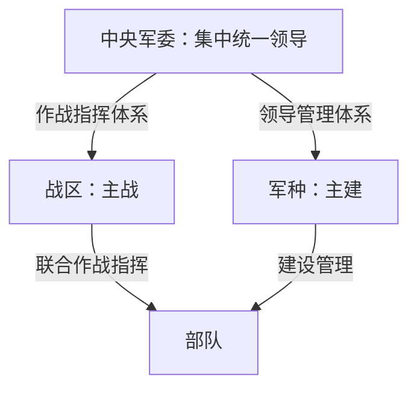

# 第八章　军队为什么需要单独一张图？

*《中国政治是怎么运转的》· 修订稿 v0.2*  
*写作与事实复核日期：2026年9月30日；资料截止日期：2026年9月29日。历史名称按当时制度使用，现任身份依据注明日期的近期公开报道。*

## 见外国防长的人，就是全军指挥者吗？

2026年9月15日，国防部长董军在北京分别同出席第十三届北京香山论坛的客人举行会谈。新华社的报道中，有外国国防部长，也有国际组织负责人；谈话涉及防务交流、人员培训、军事教育等合作。董军表示，中国军队愿与各方深化合作，共同应对全球性安全挑战。[^1]

这是一条不难读的新闻。一个国家的国防部长，与其他国家的防务负责人会面，事情和职务似乎严丝合缝。

如果让你接着画组织图，笔很可能也不会停：国务院下面有国防部，国防部下面是陆军、海军、空军，再往下是部队。部长负责国防，当然就像其他部长主管一个领域一样，统管全国军队。图画完了，甚至不用另找资料。

但恰恰是这一步，画错了。

国防部确实列在国务院组成部门之中。可宪法把领导全国武装力量的职责赋予中央军事委员会，国防法又明确，中央军委统一指挥全国武装力量。**国防部的机构归属，不能替代全国武装力量的领导指挥关系。**[^2][^3][^4]

于是，董军那场会谈带出了一个比外交礼节更基础的问题：我们认识了对外履职的国防部长，是否就认识了军事领导体系？

还没有。第一章提醒过我们，把军队放在国务院的行政树下会遗漏关键关系；第五章讲的部委分工，也不能不加区别地搬过来。这里需要单独一张图。先不用画得很大，只要分清谁领导指挥、谁组织建设，以及一个人的职务究竟能证明什么。

## “党指挥枪”，怎样落到机构上？

先找这张图的上端。这里出现的是习近平的中央军委主席职务。2026年8月的新华社活动报道仍以这一身份介绍他；本章不再重复第一章已经分开的几个头衔，而是继续问：军委主席所在的机构，怎样与党、国家和军队相接？[^5]

“党指挥枪”首先说的是中国共产党对人民军队的领导。现行党章规定，坚持党对人民解放军和其他人民武装力量的绝对领导；国防法也明确，中华人民共和国的武装力量受中国共产党领导。它不是仅指军人中有党员，也不只是说部队需要开展政治学习。[^4][^6]

向下一层看，党章规定中央军委负责军队中党的工作和政治工作，并对军队中党的组织体制和机构作出规定。这意味着党的领导有组织上的落实，不能只在整张图顶端写一个“党”字，然后把下面所有关系都留白。[^6]

这里还有一个很容易问出口的问题：既然叫“中国人民解放军”，又说“党指挥枪”，究竟是党的军队还是国家的武装力量？

如果把这两个说法当成必须二选一，就会读不懂现行制度。国防法一方面规定武装力量属于人民，另一方面明确其受中国共产党领导；宪法则规定国家中央军委领导全国武装力量。这几条规定要连在一起读。它们把人民属性、党的领导和国家军事制度放在同一套安排中，没有把其中一项写成另一项的替代品。[^3][^4]

这套安排也有历史。新中国成立后，军事领导制度经历过调整；1982年宪法设立国家中央军委，是理解今天两种军委名称的重要节点。国防部刊载的制度史文章解释，国家中央军委成立后，党的中央军委仍作为党中央军事领导机关直接领导军队，两者实际上是一个机构。这里的要点不是再添一支军队，而是把党的军事领导与国家军事领导结合起来。[^7]

所以，看到“中共中央军事委员会”和“中华人民共和国中央军事委员会”，不能想成两个各带一套部队、遇事再临时商量的最高司令部。通常所说的“一套机构、两块牌子”，是在帮助理解这种结合；它不意味着两种名称在所有文件里都可以随意互换。

差别在哪里？查人员怎样产生时，马上就看得见。党的中央军委组成人员，由党的中央委员会决定；国家中央军委主席由全国人大选举，其他组成人员由全国人大根据军委主席的提名决定。在全国人大闭会期间，有关其他组成人员的人选，由全国人大常委会依相应提名决定。[^3][^6]

第一章已经见过同一个人分别取得党内、国家职务的程序。现在把这点用在军委上：两种制度身份相互连接，产生程序仍须各自查证。不能看到一份党内公报，就把国家机构程序也当成已经报道完毕。

## 军委主席负责，不等于没有机构分工

党章、宪法和国防法都明确中央军委实行主席负责制。理解这一点，不能只看“委员会”三个字，便把最高军事领导想成几位成员不分职责地轮流主持。也不能反过来，把主席负责理解成全国每一项部队事务都只有主席一个人在办理。[^3][^4][^6]

国防法列出的军委职责，既包括统一指挥全国武装力量，也包括决定体制编制、规定军委机关部门和战区、军兵种等单位的任务职责，以及军事人员管理、规划建设等事项。主席负责制与机关、战区、军兵种的分工，并不是只能留下一个的两种安排。[^4]

因此，一条“习近平签署命令”的公开消息，可以让我们确认签署的事项和身份；至于文件由哪些机关准备、经历哪些讨论，仍要看相应材料。最高领导责任很明确，不代表我们已经获得了每项工作的完整办理记录。

军委机关也不能和军委组成人员混为一谈。机关中的部门承担具体工作，“在军委机关任职”并不自动等于“担任军委委员”。这和第四章区分工作机关与中央领导机构的道理相通，但这里要查的是军事制度自己的组织安排。[^3][^8]

再往下走，读者会遇到两组经常同框的名称：一组是东部、南部、西部、北部、中部战区；另一组是陆军、海军、空军、火箭军。它们为何不是上下串起来的一列？要回答这个问题，得回到一次改变组织图画法的改革。

## 从“军区”到“战区”，改的不只一个字

2015年11月24日至26日，中央军委改革工作会议在北京举行。习近平出席并讲话，公开报道提出改革领导指挥体制、加强军委集中统一领导、调整组建战区等要求。随后，中央军委关于深化国防和军队改革的意见，把一个总原则写得很清楚：**军委管总、战区主战、军种主建。**[^8][^9]

这十二个字看起来像口号，真正改变的却是“谁负责哪一类工作”。

军委管总，抓住的是最高层面的集中统一领导，以及战略谋划、指挥和管理。战区主战，突出联合作战指挥。军种主建，突出部队的建设管理。正式改革意见分别安排了领导管理体制和联合作战指挥体制，不是把原来的机关名称统一换短一点。[^8]

2016年2月1日，战区成立大会举行，习近平向东部、南部、西部、北部、中部战区授予军旗并发布训令。旧的大军区体制由此进入历史；读此前新闻里的军区名称，要保留当时的时间坐标，不能直接用今天某个战区的名字替换。[^10]

“战区”听起来像划出来的一块地方，初读时容易被想成军队版的省份：一个战区负责人，把某一片区域内所有军队事务全部包办。但理解这项改革，更重要的词其实是“联合”。战区主要负责联合作战指挥，要把不同军兵种力量的运用放进同一个指挥体系中；它不是某个军种的地方分局。[^11]

军种面对的则是另一类持续任务：部队怎样建设和管理，专业人才怎样培养，相关建设怎样与使用需求衔接。不同军种的专业特点并不会因为有了战区就消失。让不同力量协同运用，与把各类力量持续建设好，需要互相联系，也需要清楚分工。[^8][^11]

你可以先用两个朴素问题帮助理解：一支部队怎样被建设起来？承担任务时怎样进入联合指挥？前一个问题会把我们带向建设管理关系，后一个问题会把我们带向作战指挥关系。这只是读组织图的方法，并不是在推演某次具体行动。

国防部刊载的公开解释，把改革后的两条基本体系概括为“中央军委—战区—部队”的作战指挥体系和“中央军委—军种—部队”的领导管理体系。两条线最终指向部队，但线的含义不同。若将它们接成“军委—战区—军种—部队”一条长梯子，反而抹掉了改革要说明的分工。[^11]

*图示为2015—2016年改革所建立的两条基本关系的简化说明，不是2026年全部单位的编制表。军委机关、直属单位、武警等未展开；不能据此认定每支部队在所有事项上都经过完全相同的节点。依据见注8、11。*

“主战”和“主建”还各有一个“主”字，不能读成两边从此毫无联系。建设要考虑使用需要，联合指挥也要依靠已经建好的力量。我们需要区别的是主要职责，不是把两种工作隔成互不相通的房间。

同样，“军种”与“兵种”不是随便换着用的词。2024年国防部公布新型军兵种结构布局时，分别列出陆军、海军、空军、火箭军等军种，以及军事航天部队、网络空间部队、信息支援部队、联勤保障部队等兵种。这条资料可以提醒我们：有些重要力量本来就不能被硬塞进只有陆海空三个格子的旧图。这里不展开各自能力，先按正式公布的机构类别认识名称。[^12]

改革资料本身也有日期。2016年的文件适合解释两条体系为何建立，2024年的说明补充此后的结构变化。拿旧图读新新闻，要先更新名称和关系；拿新图读旧新闻，也不能把当时还没有的组织放进去。

## 再把董军放回来：部长、委员、军衔是三件事

现在回到9月15日的北京。董军与来宾讨论防务交流，这个公开动作是真实而明确的。把国防部长从“所有部队的直接上级”那一格移开，并不会让会谈本身失去意义；它让我们能准确地说，这是一项对外防务交往，而不是一条作战指挥命令。[^1]

一个常见追问是：既然国防部长承担这样的工作，他是不是当然就是中央军委成员？

“当然”两个字不能从这里得出。国防部长的国家机关职务，与国家中央军委组成人员的产生，适用不同程序。宪法分别规定了部长人选和军委其他组成人员人选的提名、决定方式；党内军委成员又有党章规定的产生依据。担任其中一个职务，并不自动完成另一个职务的产生程序。[^3][^6]

某个人在某个时期可以兼任多种职务，是否兼任，要看针对他的正式材料。反过来，一篇会谈稿只称“国防部长”，也不必然是一张列出他所有职务的完整履历。本章不拿报道中少写一个头衔来判断任免，更不依据旧名单补出截至2026年9月的军委全表。

军衔又是另一回事。上将、中将、少将等，是军衔名称；部长、司令员、政治委员等，则是职务名称。军衔与任职当然相关，但不能只看肩章，就知道一个人在这件事上指挥谁。

国防部在2021年军官制度改革的公开说明中，把军衔等级、岗位职务层级和待遇级别分开解释，并说明它们存在对应关系。军衔在军官等级管理中起主导作用，岗位职务层级则与晋升任用、领导指挥关系相联系。这里不用背完等级表，只要知道：**军衔不是一份逐人逐单位的指挥权限清单。**[^13]

假设读者在两篇报道中看到两位军官军衔相同，仅凭这一点，无法断定他们互相指挥，也无法断定职责相同。真正要补的，是准确职务、所属机构和所涉事项的正式关系；不能用“级别差不多”代替这些资料。

所以，遇到军队人物介绍，可以把三个问题分开放：这个人担任什么岗位？是否在某个领导机构中任职？具有何种军衔？三项答案可以同时出现在同一人身上，却不能互相推算。换人、调职、晋衔和机构调整也分别是不同消息，应按相应公开公告记录。

## 单独画图，不等于与国家其他部分隔开

到这里，另一种误会可能出现：既然军委统一指挥武装力量，国务院是不是就和国防无关？

当然不是。国防法把国务院领导和管理国防建设事业的职责单列出来，包括有关规划、国防科研生产、国防经费和国防资产，以及拥军优属和退役军人保障等工作。国务院与中央军委还有共同承担、相互协调的事项，法律专门规定二者建立协调机制，解决国防事务的重大问题。[^4]

这就像把原先混在一根线里的问题重新分开：统一指挥武装力量是一类职责，组织国防建设相关行政事务是另一类职责。两者会相接，却不能因为有联系，就把军委画成国务院的内设机构，或把国务院的国防职责全部换成国防部长个人的权限。

“武装力量”的范围也比日常所说的“军队”更需要讲清。国防法列明中国人民解放军、中国人民武装警察部队和民兵；其中解放军又分现役部队与预备役部队。本章的战区、军种简图主要解释解放军改革中的基本关系，不是一张覆盖所有武装力量的完整地图。[^4]

单独画图的意义，因而不是神秘化军队，也不是声称它与法律、国家机关没有关系。宪法规定军委主席对全国人大及其常委会负责，国防法要求武装力量遵守宪法和法律。我们只是承认：军事领导、行政管理、法定监督和人员产生是不同关系，必须分别画清楚。[^3][^4]

再看董军的会谈，已经不需要从他身后想象一条通向所有部队的行政长链。知道他以何种身份做了什么，再知道这项工作所在的制度位置，新闻就足够具体了。至于会谈之后有哪些内部安排，报道没有给出，不能用一张看似完整的图替它补上。

## 新闻重读：给那张顺手画出的图改三笔

请重读2026年9月15日董军会谈的新华社报道。有人据此画出“国务院—国防部—战区—军种—部队”，并说：“国防部长既然代表军队会谈，就当然是军委成员；再按军衔排一遍，指挥关系就齐了。”[^1]

1. 这条长链错在哪里？战区与军种应怎样区分？
2. 董军的会谈能否证明“国防部长当然是军委成员”？应查什么来判断具体兼任情况？
3. 军衔排序能否补全指挥关系？假如手边只有2016年前的组织图，又该先检查什么？

**参考解释**

第一题，国防部虽是国务院组成部门，统一指挥全国武装力量的职责却属于中央军委。战区主战、军种主建，主要对应作战指挥与建设管理两条关系，不能串成战区在上、军种在下的一条链；本章简图也不能套用于每个单位的全部事务。[^2][^4][^8][^11]

第二题，不能。会谈报道证明董军当日以国防部长身份履行公开防务交往职责，不替代党内军委决定或国家机构相应决定。应按具体日期核对正式任职材料和后续变化，不能由部长职务自动推定兼任，也不能把一篇报道的头衔写法当成全部职务证明。[^1][^3][^6]

第三题，不能。军衔与职务相关，指挥关系仍须看岗位、机构和具体任务的制度依据。旧组织图还应先核对适用年代，检查军区、军委机关及军兵种名称和关系是否经过改革调整；不能只换掉几个人名，就当作今天的图。[^8][^12][^13]

下一次读到军事新闻，先不忙着问谁排在谁前面。把“以什么身份做了什么”看清，再找那条关系的正式依据。这张图便能帮助你理解新闻，而不会把公开资料里没有的命令也画进去。

---

## 注释与资料

[^1]: 新华社梅常伟，[《董军同出席北京香山论坛客人举行会谈》](https://www.mod.gov.cn/gfbw/qwfb/16486622.html)，国防部网2026年9月15日刊载，电头与事件日同为9月15日。首段确认董军国防部长身份、分别会谈及第十三届论坛；后文载有关防务合作表述。本章不把分别会谈写成一场多人共同会议，不展开外国来宾人物线。

[^2]: 国务院[《关于机构设置的通知》](https://app.www.gov.cn/govdata/gov/202303/20/498124/article.html)，国发〔2023〕5号，2023年3月16日，网页3月20日刊载，“二、国务院组成部门”列国防部。本注只支持机构类别，不用它证明部长现任身份或军事指挥权限。

[^3]: 新华社受权发布[《中华人民共和国宪法》有关国家机构人员产生条文](https://www.mod.gov.cn/gfbw/qwfb/4807542_4.html)，2018年修正文本，国防部网2018年3月22日刊载：第六十二条第五、六项及第六十七条第九、十项区分部长与国家军委组成人员的决定程序；国家主席任免部长依据另见[第八十条](https://www.mod.gov.cn/gfbw/qwfb/4807542_5.html)。[第九十三、九十四条](https://www.mod.gov.cn/gfbw/qwfb/4807542_7.html)规定军委领导全国武装力量、组成、主席负责制及军委主席对全国人大和全国人大常委会负责。全国人大常委会监督中央军委工作的依据另见第六十七条第六项。本章不将“负责”自行增写为与国务院相同的工作报告制度。

[^4]: 新华社受权发布[《中华人民共和国国防法》](https://www.mod.gov.cn/gfbw/fgwx/flfg/4876050.html)，2020年12月26日修订，2021年1月1日起施行，国防部网12月27日刊载。第二章第十四至十七条分别规定国务院与中央军委的国防职权、主席负责制及协调机制；第二十至二十三条规定武装力量的人民属性、党的领导、组成及遵守宪法法律；第二十六条涉及衔级制度。不得把国务院整体职权转写成国防部长个人职责。

[^5]: 新华社[2026年8月17日大会报道](https://www.news.cn/politics/leaders/20260817/c09eaee334464122a24e6a6b67e756a3/c.html)，首段及图片说明明确习近平中央军委主席身份。仅用于截止日前的近期职务核对，不将本活动另作正文案例，也不据此核对军委全体成员。

[^6]: [《中国共产党章程》](https://www.12371.cn/special/zggcdzc/zggcdzcqw/)，2022年10月22日通过。总纲有关人民武装力量的段落规定绝对领导；第二十三条规定党的中央军委组成人员由中央委员会决定、军委实行主席负责制；第二十四条规定中央军委负责军队中党的工作和政治工作、规定有关组织体制和机构。正文按2022年版本解释，不倒用于早期历史。

[^7]: 国防部网刊载[《铸牢人民军队的建军之本强军之魂》](https://www.mod.gov.cn/gfbw/jmsd/4850796.html)，2019年制度史论述，定位“坚持执政必执军和强国必强军有机统一，健全完善党和国家军事领导制度”段。明确1982年宪法与国家军委设置背景，并称党与国家的中央军委实际上是一个机构。本注属于官方制度史解释，现行产生程序仍按注3、6原文核对。

[^8]: 中央军委[《关于深化国防和军队改革的意见》](https://www.mod.gov.cn/gfbw/qwfb/jwgghbzbgs/4917411.html)，文内落款2016年1月1日，本链接为国防部网2022年8月5日再刊。“二、改革的总体目标和主要任务”第（一）至（三）项明确总原则、军委机关改革、军种领导管理和战区联合作战指挥体制。正文将其作为2015—2016年改革依据，不把再刊日期误作改革时间，不把历史安排当成2026年完整编制表。

[^9]: 新华社[《习近平：全面实施改革强军战略　坚定不移走中国特色强军之路》](https://www.xinhuanet.com/mil/2015-11/26/c_128472682.htm)，2015年11月26日，首段载会议于11月24—26日召开、习近平身份与讲话。只介绍公开改革部署，不复原内部讨论或推测人事动机。

[^10]: 新华网[《习近平的2016（贰月）》](https://fms.news.cn/swf/xjp2016_sjxw/feb/index.html)，2月1日条目记录战区成立、授旗和训令；关于原七大军区撤销的时间，参见国防部网[《武汉和湖北为何属中部战区辖区？》](https://www.mod.gov.cn/gfbw/gfjy_index/4860772.html)“中部战区时期”首段。本章仅取历史名称与机构变动，不使用该文地理范围、部署或能力说明。

[^11]: 周东滨，[《“战”与“建”的辩证法：坚持以战领建　强化战建统筹》](https://www.mod.gov.cn/gfbw/jmsd/4913001.html)，解放军报2022年6月15日，国防部网刊载，正文第二段概括军委—战区—部队和军委—军种—部队两条体系，说明战区与军兵种主要职责。属公开制度解释，与注8改革原文对照使用；不引用其中对实际能力和效果的评价。

[^12]: 国防部[《中国人民解放军形成新型军兵种结构布局》](https://www.mod.gov.cn/gfbw/qwfb/16302054.html)，2024年4月19日专题记者会答问，中英文分别列明四个军种、四个兵种。仅用于说明2024年公布的机构类别和旧图需要更新，不推定各兵种的内部编成与具体指挥安排。

[^13]: 国防部[《新的军官制度由基于职务等级调整为基于军衔等级》](https://www.mod.gov.cn/gfbw/xwfyr/lxjzhzt/2021njzh/2021n1y/4878158.html)，2021年1月28日例行记者会答问，解释军衔等级、岗位职务层级、待遇级别及其关系。正文只取区别与联系，不把旧版军衔条例的职务等级表当成现行岗位对应表，不靠军衔推定个人完整权限。
