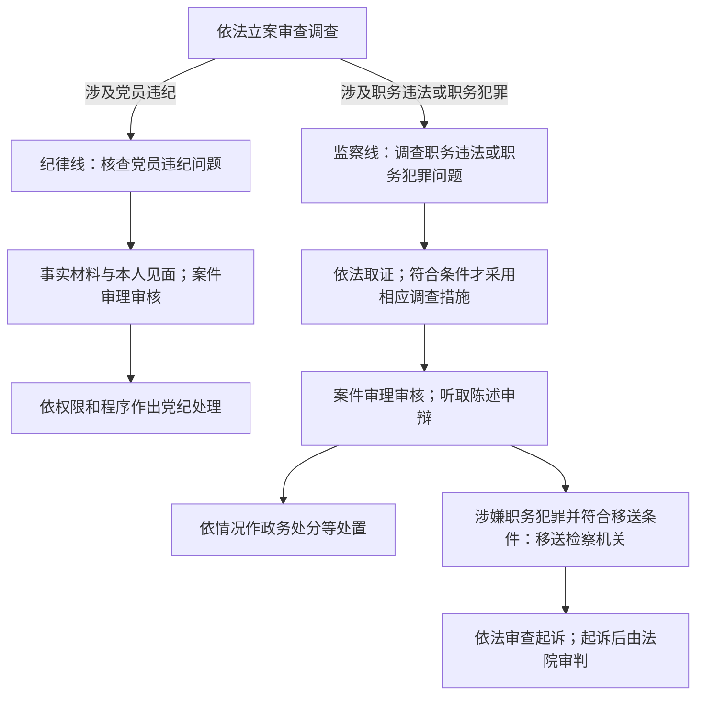

# 第14章　纪委敲门之后

版本：v0.1｜成稿日期：2026年10月2日｜事实截止：2026年9月29日

2022年3月31日，一份关于傅政华的处分通报，把几种不同的决定放在了一起：开除党籍、开除公职，以及将涉嫌犯罪问题移送检察机关依法审查起诉。这些动作出现在同一段文字里，却没有一个可以代替其余两个。失去党员身份，不等于已经受到刑事判决；失去公职，也没有把涉嫌犯罪问题处理完毕。[^1]

这正是“纪委敲门之后”最容易被读错的地方。这个章名是日常说法，并不表示公开材料记载了谁在什么时间敲过傅政华的门。现实中的新闻常常只公布几个节点，中间的取证、审批和审核过程未必公开。读者若把它们补成一部连续的办案故事，反而会离事实越来越远。

第7章已经介绍过纪委监委、检察院和法院的基本分工。这里换一个观察位置：同一个案件进入纪检监察机关以后，哪些问题属于纪律，哪些属于国家法律？调查措施怎样使用，谁来检查调查形成的意见？被调查人的陈述、申辩和申诉，又在程序的什么地方发生作用？

## 一份通报，两种身份

傅政华当时既是党员，又是公职人员。2021年10月2日，新华社转发中央纪委国家监委网站消息，公布他涉嫌严重违纪违法，正在接受纪律审查和监察调查。“纪律审查”和“监察调查”并列，是因为同一个人的行为可能同时需要放进两套规范中判断。前一个问题涉及党员是否违反党纪，后一个问题涉及公职人员是否职务违法或者涉嫌职务犯罪。[^2]

合署办公让这两种工作可以衔接，但没有让两种身份、两种职能变成同一件事。2021年施行的监察法实施条例，已经规定监察机关与党的纪律检查机关合署办公，推动纪律监督和国家监察相互贯通。随后发布的纪委工作条例进一步明确，一套工作机构、两个机关名称，履行纪检、监察两项职责。这里的“两个名称”对应着不同的履职依据，不是新闻写作上的简称和全称。[^3]

把这个区别放回处分通报，就容易看清楚：开除党籍处理的是党员身份，国家监委作出的开除公职处理的是公职身份。对一个不是党员的监察对象，没有开除党籍这一项；对一个有违纪问题的党员，也不能仅凭党员身份，认定其所有问题都属于监察机关调查的职务违法。监察对象的范围，要依据法律看他是否属于行使公权力的公职人员，不能把“党员”和“监察对象”画上等号。

这也是为什么“双开”虽然常见，却不是所有案件的标准结局。党纪处分有警告、严重警告、撤销党内职务、留党察看和开除党籍；政务处分另有警告、记过、记大过、降级、撤职、开除。两个序列中的相近词语，应分别放回各自制度理解。撤销党内职务与政务撤职所针对的职务不同，开除党籍与开除公职所改变的身份也不同。[^4]

新闻把两项处分压缩成两个字，读者则需要把它们重新展开。只有展开以后，才能继续问：是谁依据什么规范作出决定，履行了什么审批程序，还有哪些法律责任尚未处理？

## “接受调查”没有写出的前半段

2021年10月的消息很短。它告诉读者案件已经进入公开的纪律审查、监察调查阶段，却没有交代线索从哪里来、初步核实怎样进行，更没有列出已经采用的全部措施。我们能从制度中解释这些词，不能用制度规定替案件补写经历。

依照当时施行的监督执纪工作规则，问题线索可以通过谈话函询、初步核实、暂存待查、予以了结等方式处置。初步核实是对具有可查性的问题收集客观证据、检验真实性和准确性；经过初核，需要追究纪律或者法律责任，具备相应事实和证据条件的，才按程序报批立案。线索进入机关，并不意味着举报内容已经成立，更不意味着一定会有处分。[^5]

这种区分对读新闻很有用。“收到举报”“开展初核”“立案审查调查”“作出处分”描述的是不同状态。一篇报道即使同时写到几种状态，也应当分清它是在回顾经过，还是宣布最新进展。不能看见最初的一条消息，就提前把最后的责任结论填进去。

程序进入不同阶段，可以采用的措施也有区别。2021年监察法实施条例区分了初步核实与立案调查中的措施：初核可以依法采用谈话、询问、查询、调取等措施；讯问、留置、冻结、搜查、查封、扣押等，则须在立案后依法采用。每一项还要满足自身条件并履行审批手续，不能把“已经立案”理解成获得了不受限制的处置权。[^6]

连几个看起来近似的动词，也不能随意互换。按照2018年监察法，了解可能发生的职务违法问题，可以谈话或者要求说明；调查涉嫌职务犯罪的被调查人，可以讯问；向证人等人员了解情况，可以询问。日常语言都可能说成“找人问话”，法律文本却要区分对象和用途。读者不必背下整张措施清单，但应当知道，通报使用的动词携带着程序信息。

同时，一名证人被询问，不等于他已经成为涉嫌犯罪的被调查人；一个账户被查询，也不等于其中资金已被认定为违法所得。措施首先服务于查明事实，结论还要靠证据和后续判断。把措施名称直接翻译成有罪结论，会跳过整个调查要解决的问题。

## 留置是措施，不是处分

在本章核验的傅政华案公开材料中，没有找到足以确认其是否被采取留置措施、何时开始和何时解除的披露。因此，下面讲的是案件办理时的制度，不能当作他的个人经历。

当时有效的2018年监察法规定，对涉嫌严重职务违法或者职务犯罪的人，在已经掌握部分违法犯罪事实及证据、仍有重要问题需要进一步调查，并且存在法律列举情形时，经过依法审批，可以采取留置。所列情形包括案情重大复杂，可能逃跑、自杀，可能串供或者伪造、隐匿、毁灭证据，以及可能有其他妨碍调查行为。这里既有案件和证据条件，也有需要采取措施的具体情形。[^7]

留置会限制人身自由，但它本身不决定当事人应受哪一种党纪处分、政务处分或者刑罚。采取留置以后仍然要调查；调查形成的证据仍然要接受审核。也不能反过来认为，既然最后没有犯罪判决，就说明调查期间必然没有任何可以依法采用的措施。措施的合法性要看采用时的法定条件和程序，责任结论则要看最终查明的事实及适用规范。

审批和期限，是判断这种措施是否依法运行的重要入口。旧法要求监察机关领导人员集体研究决定；设区的市级以下监察机关采取留置，要报上一级监察机关批准；省级监察机关采取留置，报国家监委备案。旧法中的通常期限是三个月，特殊情况下可以延长一次，延长不超过三个月，并有相应审批要求。发现采取不当或者不需要继续采取的，应及时解除。[^7]

这组期限不能拿来直接计算傅政华案。调查消息发布日未必就是某项措施的起算日，而从调查通报到处分通报的时间，也不是某项限制人身自由措施的已知持续时间。2021年实施条例将留置期限的起算点明确为向被调查人宣布留置决定之日。缺少这个事实，就不能用新闻日期做减法，得出是否超期的结论。[^6]

权利保障也不是附在期限后面的一句原则。旧法规定，采取留置后，应在二十四小时内通知所在单位和家属；可能毁灭证据、干扰证人作证或者串供等有碍调查情形属于法定例外，情形消失后应立即通知。例外不等于可以长期不说明理由地不通知。饮食、休息、安全和医疗服务也有明确要求，讯问应合理安排时间和时长，笔录应由被讯问人阅看后签名。[^7]

财产措施同样有边界。查询是了解情况，冻结是限制财产流动，查封、扣押又有各自对象和手续，不能笼统说成“钱已经没收”。2018年监察法要求，对查明与案件无关的查封、扣押、冻结财物，在规定期限内解除、退还；2021年实施条例还规定，冻结财产应为被调查人及其所扶养亲属保留必需的生活费用。[^6][^7]

这些条文有助于提出具体问题：有没有对应的决定和审批，是否到了应当解除的时间，无关财物有没有排除，生活和医疗保障是否落实。但本案新闻没有逐项公开答案，不能因为法律有规定，就写成“傅政华在调查期间已经获得了每一项保障”；也不能因为通报没有写，就断言程序必然没有执行。

## 调查形成意见，还要经过审理

“查清了”不是一个调查人员口头宣布以后，案件就可以直接走向最终决定。监督执纪工作规则要求，调查过程中形成违纪违法事实材料，应与本人见面，听取意见；调查终结形成报告，还要按照程序移送审理。政务处分法同样要求，拟作出处分前告知所认定的事实和拟处分依据，听取陈述、申辩，对提出的事实、理由、证据进行核实。成立的，应当采纳；不能因为当事人申辩而加重处分。[^5][^8]

这里出现的“审理”，容易让人误以为已经到了法院。实际上，纪检监察机关内部也有案件审理工作，它负责审核调查形成的事实、证据、定性、处理意见和程序。它与法院审判不是同一道程序。读新闻时，先看“谁在审理”，比只认“审理”两个字更可靠。

工作规则规定，审查调查与审理相分离，审查调查人员不得参与审理；审理部门由两人以上全面审核案卷材料，并按规定同被审查调查人谈话，核对事实、听取辩解。主要事实不清、证据不足，可以退回重新审查调查；需要补充完善证据，也有退回补充的程序。调查意见因此不是一份只能照抄的定稿。[^5]

证据标准也不能省略。2018年监察法要求依法收集被调查人有无违法犯罪及情节轻重的证据，禁止刑讯逼供以及以威胁、引诱、欺骗等非法方式收集证据。涉嫌职务犯罪案件的证据，应与刑事审判的证据要求和标准相一致；非法证据应依法排除，不能作为案件处置依据。对讯问以及搜查、查封、扣押等重要取证工作，还规定了全程录音录像要求。[^7]

“查办案件”和“约束办案”在这里同时出现。一个人受到严厉指控，并不会让针对办案行为的规则失去作用。反过来，程序审核发现需要补证，也不能简单理解成对指控的默认确认。审核的意义正在于，调查者提出的判断还须经受检查，事实与证据中的缺口应当被看见。

对于读者而言，这是一道重要的阅读边界。公开处分通报会列举认定的问题，通常不会把全部证据和审理意见向社会展开。我们可以准确转述“通报认定了什么”，却不应声称自己仅凭通报就重新完成了证据审查。对纪律认定、检察机关指控和法院认定，也应当分别标明来源，不能在叙述中悄悄互换。

还可以把“有权提出意见”与“意见必然被接受”分开。陈述申辩提供的是一个表达、核实和纠正错误的入口，并不保证所有异议都成立；机关也不能仅以当事人受到调查为由，跳过核实。程序要求的重点，是把意见纳入判断，并按相应规则处理，而不是让当事人只能在已经写好的结论下面签字。

比如，当事人认为某笔财物与本人无关，首先是一个需要核查的事实问题；认为特定行为不应按拟定条款处理，则涉及定性和适用依据。两种意见可能需要不同材料来支持，却都不能简单等同于“不认错”。政务处分法禁止因申辩而加重处分，正是在处分程序中为表达异议留下明确位置。这里举的是阅读规则的方法，并非转述傅政华曾提出这些具体意见。[^8]

## 双开这一天，哪些事情已经决定

回到2022年3月31日。傅政华处分通报中的主体和程序写得很具体：开除党籍经过中央纪委常委会研究，并报中央政治局会议审议决定；开除公职由国家监委作出。通报同时说明，开除党籍处分待召开中央委员会全体会议时予以追认。这一安排与他当时的中央委员身份有关，不能把这段审批文字机械套在所有党员身上。[^1]

同一份通报还把严重违反纪律、严重职务违法与涉嫌犯罪分开表述。“涉嫌”没有因为前面的处分已经作出就消失。纪律和政务责任可以依法形成处理决定，而犯罪是否成立、应判何种刑罚，还须进入刑事程序。双开之后移送，并非再把已经完成的一次刑事判决复印给另一机关。

适用规则时还要多看一层时间。傅政华案办理期间已有2018年纪律处分条例、2018年监察法、2020年政务处分法和2021年监察法实施条例。但行为发生时间跨越多年，不能据此说每一笔历史行为都一律直接适用办案时的新规定。纪律处分条例和政务处分法分别设有对施行前行为的衔接规则，包含从旧兼轻的处理要求。通报没有逐笔展开适用过程，本章也不替它补算。[^4][^8]

处分决定并不消灭救济渠道。党纪处分有申诉制度；对监察机关作出的政务处分不服，可以依法申请复审，对复审决定仍不服，可以按规定申请复核。政务处分法还规定，复审、复核期间不停止原处分决定执行，不能因提出复审、复核而加重处分。是否继续执行与是否允许申请救济，是两件不同的事。[^4][^8]

针对调查措施的申诉，又与针对处分结果的复审复核不同。2018年监察法列举了留置期限届满不解除、对与案件无关财物采取措施以及应当解除而不解除等情形，被调查人及其近亲属可以申诉；受理机关和上一级监察机关分别负有按期处理、复查职责。提出这种申诉，是要求检查特定办案行为是否合法，不等于必须先证明整个案件没有任何问题。[^7]

因此，问“当事人能不能提出异议”，最好继续追问异议指向什么：事实认定，拟作处分，已经作出的政务处分，还是某项调查措施？指向不同，程序入口和处理机关也不同。把它们统称为“上诉”，会把纪检监察程序与法院裁判后的救济混在一起。

同样，处分通报写有“收缴违纪违法所得”，也不意味着可以把当事人和家属的所有财产都视为处理对象。财物与行为的关系需要查明；调查阶段为了查清关系采取的控制措施，与作出处理时对财物性质的认定，分属不同问题。对法院后来依法判处的没收财产，也应保留刑事裁判这一依据，不能把它与调查中冻结账户混写成同一个动作。

这类区别不是为了给每条新闻加上一长串术语，而是为了避免几个常见跳跃：从“财物被控制”跳到“全部属于违法所得”，从“本人提出申辩”跳到“妨碍调查”，从“处分继续执行”跳到“没有任何救济”。能停住这些跳跃，读者才有可能把后续报道中新增的事实接到正确位置。

## 移送以后，新闻里的动词又变了

2022年4月21日公布的消息说，最高人民检察院日前对傅政华作出逮捕决定。7月11日的起诉消息则说明，案件经最高检指定，由长春市人民检察院审查起诉，近日已向长春市中级人民法院提起公诉。两个报道日期分别是消息公布日；“日前”和“近日”并没有提供决定、起诉发生的精确日期。[^9][^10]

这个小区别能阻止读者制造虚假的日程表。我们知道先后关系，也知道公开的程序节点，但不能把报道日期全部换成机关实际操作日。对于尚未公开的措施，更不能从前后两个日期推算出中间每天发生了什么。

起诉报道还有一项值得注意的信息：检察机关已经告知傅政华相关诉讼权利，讯问了他，并听取辩护人的意见。这里是对本案已经公开的程序事实作出说明，证据强度不同于上一节“法律规定应当怎样”的一般解释。它也提醒读者，刑事诉讼中的辩护程序要放在对应阶段阅读，不能把这一句话倒写成监察调查阶段每一次谈话都有辩护人在场。[^10]

2022年9月22日，长春市中级人民法院一审宣判。法院以受贿罪、徇私枉法罪追究傅政华刑事责任，决定执行死刑、缓期二年执行等刑罚，并明确在死缓期满依法减为无期徒刑后，终身监禁，不得减刑、假释。这里的“一审”“死缓”和附加的执行限制，都不能省略成一句含义不同的“已执行死刑”。本章依据的是这次一审公开结果，不把它扩写成未经另行核验的终审或者服刑现状。[^11]

从调查消息到一审，人物还是同一个人，文字中的法律状态却在改变：涉嫌违纪违法、受到处分、被决定逮捕、被提起公诉、被法院判决。这些状态可以先后出现在同一个案件里，也不能因此相互替代。特别是逮捕属于刑事强制措施，并不是法院最终确定的刑罚。

## 把两条线画在同一张图上

下面是制度关系简图，采用傅政华案办理时的2021—2022年制度版本。它解释两类责任怎样分别处理，不声称图上每个动作都已在本案公开证实，也不是所有案件必经全部节点的时间表。监察线中的调查措施依法选择使用，存在政务处分而不移送刑事程序的案件，也存在依据调查结果作其他处理或者撤案的情形。[^5][^6][^7][^8]

读图时尤其不要画出一条“开除党籍必然导致判刑”的箭头。纪律标准、政务责任和刑事责任各有判断要求。图上的分叉，也不表示办案机构在同一天一定分别发出全部文书。真实案件的先后顺序、决定时间和审批过程，要回到公开材料逐项确认。

## 到2026年，要换哪一本规则

旧案讲到这里，还不能把它直接当成今天的程序手册。监察法于2024年12月修正，修正后的法律自2025年6月1日起施行；监察法实施条例也在2025年修订施行。因此，读2026年的消息，应使用当时有效的文本，不能只凭旧案记住的条号、措施名称和期限作判断。[^12]

新法增加了强制到案、责令候查、管护等措施，并分别规定适用条件和程序。责令候查涉及在一定条件下对被调查人提出到案、活动等要求；管护则针对法律规定的特定情形，并有严格时间约束。这些名称并不是把所有调查对象一律留置的不同叫法。是否采用哪一项，要看具体条件和依法审批，不能因新闻出现“到案”，就认定使用了法定的强制到案措施。

期限规则也发生了变化。新法在原有留置期限框架之外，对特定重大职务犯罪案件规定了进一步延长以及重新计算期限的条件、审批和限制。因此，“留置最多六个月”不能脱离法律版本和具体条件，作为适用于所有年份、所有案件的口号。反过来，也不能把新法中的例外理解成可以自行无限延长。[^12]

新法第五条明确写入尊重和保障人权，并在具体措施中增加相应保障。第五十条规定，被管护人员、被留置人员及其近亲属有权申请变更管护、留置措施；监察机关收到申请后，应在三日内作出决定，不同意变更的，应告知并说明理由。这是一个可以具体查问是否履行的程序要求。它不能倒用于确认2021年案件实际享有同一条文规定的申请程序，也不意味着旧法没有任何人身、财产和申诉保障。[^12]

现实中的机构负责人如何描述这项工作，也值得对照制度阅读。2026年1月，李希在中央纪委全会工作报告中提出强化法治、程序和证据意识，并把完善内部权力制约、规范办案等列入工作要求。这说明在公开的年度工作安排中，查办案件和规范权力运行同时存在。报告中的拟制定、拟修订事项，应按工作安排理解，不能直接当成已经生效的新规则。[^13]

截至本书事实截止日之前，2026年9月新华社关于李希调研的报道，仍以中共中央政治局常委、中央纪委书记介绍其职务。这里引入他，是给读者一个现实的机构坐标，不是要暗示他亲自负责前述案件，更不是从现任领导的讲话推定每个历史案件的内部安排。[^14]

下次再看到“接受纪律审查和监察调查”，可以先停在消息已经确认的位置：两个职能正在履行，结果还没有由这句话决定。看到“双开”，再分别确认党纪与政务处理；看到“移送”，继续找检察机关和法院的后续消息。至于留置、通知、取证和申辩等具体程序，公开材料能证明多少，就写到多少。制度帮助我们知道该问什么，证据决定我们能够回答什么。

## 新闻重读

请重读2022年3月31日傅政华处分通报，以及7月11日的提起公诉消息。前一份材料分别公布了开除党籍、开除公职和涉嫌犯罪问题移送审查起诉；后一份材料说明检察机关已经提起公诉，并履行告知诉讼权利、讯问、听取辩护人意见等程序。[^1][^10]

**问题一：3月31日能否写成“傅政华已经被判有罪”？**

不能。该通报公布纪律、政务处理和移送事项，对犯罪问题仍使用涉嫌表述。刑事判决要另找法院材料。本章核验的一审宣判发生在9月22日，不能倒填进3月的消息。

**问题二：开除公职和开除党籍，是不是同一项决定的两种叫法？**

不是。它们处理不同身份，适用规范和作出决定的主体、程序也不同。应保留通报对两项决定的分别表述，不能因为机关合署办公就抹掉区别。

**问题三：能否据此认定他曾被留置，并计算留置了多少天？**

不能。本章所核验材料没有提供足够披露。调查通报日、处分通报日和逮捕消息公布日，都不能自行充当留置起止日。可以解释当时留置的法律条件，不能据此断言本案采用过它。

**问题四：7月的消息能证明什么程序事实？今天的新法能否补写此前的过程？**

消息能够支持检察机关已经告知相关诉讼权利、讯问当事人并听取辩护人意见，不能证明未披露的所有调查措施。2025年施行的新规则应作为新时期制度阅读，不应用来补写2021—2022年案件，也不能将其新增措施想当然地安在旧案当事人身上。

---

[^1]: 中央纪委国家监委：《全国政协社会和法制委员会原副主任傅政华严重违纪违法被开除党籍、开除公职》，2022年3月31日；实际读取[东营市纪委监委全文转载](https://www.jiwei.gov.cn/news_content.thtml?contentId=38684)。涉及开除党籍审批及待追认、国家监委开除公职、移送审查起诉；本文不复述通报中的其他人物及关系指控。访问：2026年10月2日。
[^2]: 新华社：[《傅政华接受中央纪委国家监委纪律审查和监察调查》](https://www.news.cn/politics/2021-10/02/c_1127925714.htm)，2021年10月2日。此消息没有披露留置。访问：2026年10月2日。
[^3]: [《中华人民共和国监察法实施条例》2021年公布文本](https://www.12371.cn/2021/09/20/ARTI1632129321756718.shtml)，第三条；[《中国共产党纪律检查委员会工作条例》](https://www.12371.cn/2022/01/04/ARTI1641297865640351.shtml)，第七条。后者于2021年12月24日发布，不作为同年10月启动调查时已经生效的依据。访问：2026年10月2日。
[^4]: [《中国共产党纪律处分条例》2018年文本](https://www.12371.cn/2018/08/27/ARTI1535321642505383.shtml)，第八条、第四十二条、第一百四十二条；[《中华人民共和国公职人员政务处分法》](https://www.xinhuanet.com/politics/2020-06/20/c_1126139921.htm)，第七条。本文以当时版本说明处分序列，不替案件逐笔确定历史行为适用条款。访问：2026年10月2日。
[^5]: 新华社：[《中国共产党纪律检查机关监督执纪工作规则》](https://www.xinhuanet.com/politics/2019-01/06/c_1123953624.htm)，2019年1月6日公布全文，第二十一条、第三十二至三十八条、第五十一条、第五十三至五十九条。重点核对初核、立案、事实材料见面、审查调查与审理分离、退回补充、处分申诉等。访问：2026年10月2日。
[^6]: [《中华人民共和国监察法实施条例》2021年文本](https://www.12371.cn/2021/09/20/ARTI1632129321756718.shtml)，第五十四至五十六条、第一百零一至一百零五条；2021年9月20日起施行。用于说明措施的阶段、审批、取证录音录像、留置起算、解除及冻结财产生活费保障，不证明个案实际采用这些措施。访问：2026年10月2日。
[^7]: [《中华人民共和国监察法》2018年文本](https://news.12371.cn/2018/03/21/ARTI1521630021724476.shtml)，第十五条、第十九至二十五条、第三十三条、第四十至四十五条、第六十条。特别注意旧法第四十三、四十四条对应留置期限、通知及人身保障；不能与修正后相同条号混读。访问：2026年10月2日。
[^8]: 新华社：[《中华人民共和国公职人员政务处分法》](https://www.xinhuanet.com/politics/2020-06/20/c_1126139921.htm)，2020年7月1日起施行；第四十二至四十四条、第五十五至五十六条、第六十七至六十八条，分别涉及证据、陈述申辩、处理、复审复核和施行前行为衔接。访问：2026年10月2日。
[^9]: 新华社：[《最高人民检察院依法对傅政华决定逮捕》](https://www.12371.cn/2022/04/21/ARTI1650525674108489.shtml)，共产党员网转载，2022年4月21日。原文说“日前”，本文不将公布日当成逮捕决定精确日期。访问：2026年10月2日。
[^10]: 新华社：[《吉林检察机关依法对傅政华涉嫌受贿、徇私枉法案提起公诉》](https://www.12371.cn/2022/07/11/ARTI1657520118884975.shtml)，共产党员网转载，2022年7月11日。原文说“近日”，并记载告知诉讼权利、讯问、听取辩护人意见。访问：2026年10月2日。
[^11]: 最高人民法院网站、人民法院新闻传媒总社：[《全国政协社会和法制委员会原副主任傅政华受贿、徇私枉法一案一审宣判》](https://www.court.gov.cn/zixun/xiangqing/372721.html)，2022年9月22日。本文只标明一审公开结果，完整刑罚以原文为准。访问：2026年10月2日。
[^12]: [《中华人民共和国监察法》2024年修正文本](https://zygjjg.12388.gov.cn/html/law/8.html)，中央和国家机关纪工委监察工委举报网站法律法规页，2025年6月1日起施行；第五条、第二十一条、第二十三至二十五条、第四十六至五十条；国家监察委员会公告第2号及[2025年修订实施条例官方转载](https://www.kflz.gov.cn/sitesources/zmdjw/page_pc/xsqjw/xcx/djfg/article71d3f735a9e2465bb7e7d51ed82d734f.html)。新法第四十八条含留置期限特殊规定，第五十条含变更措施申请；此注仅支撑新时期制度对照。访问：2026年10月2日。
[^13]: 李希：《以更高标准、更实举措推进全面从严治党，为实现“十五五”时期目标任务提供坚强保障——在中国共产党第二十届中央纪律检查委员会第五次全体会议上的工作报告》，报告日期2026年1月12日，重点为2026年任务中关于纪检监察队伍建设的第（六）项；[九三学社中央官网全文转载](https://www.93.gov.cn/xwjc-szyw/783326.html)。报告中的年度制度建设安排不作已经完成的事实使用。访问：2026年10月2日。
[^14]: 新华社：[《李希在贵州调研》](https://www.news.cn/politics/leaders/20260904/4dad192c39bf4138a9aa502f1d0eca32/c.html)，2026年9月4日刊发，记载9月1日至3日调研及当时职务。访问：2026年10月2日。
