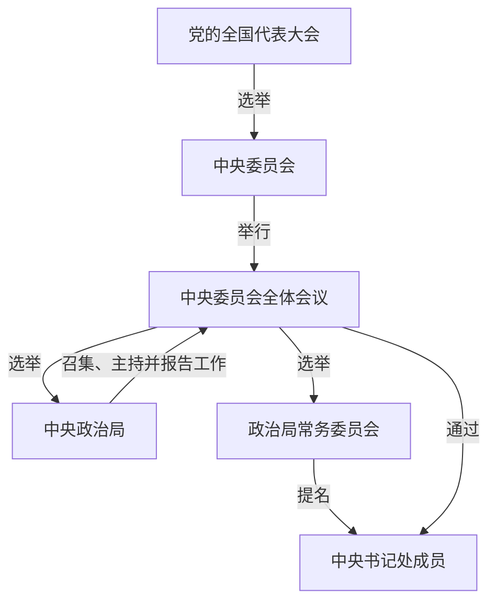

# 第三章　北京最重要的几张桌子

*《中国政治是怎么运转的》· v0.1*  
*写作与事实核验日期：2026年9月29日。文中的“五中全会”仍是已宣布、尚未举行的会议。*

## 文件已经讨论了，为什么还要开一次会？

2026年9月21日，一条中央政治局会议新闻里出现了三个动作。会议决定：二十届五中全会将于10月26日至29日在北京召开。政治局听取了一份决定稿征求意见情况的报告。政治局还决定，根据这次会议讨论的意见修改文件稿，然后提请五中全会审议。习近平主持了这次政治局会议。[^1]

读到这里，可能有人会问：政治局不是已经开会讨论了吗？既然它能定下全会日期，为什么这份文件还要交给另一个会？如果标题里都叫“中央”，这几张桌子究竟有什么区别？

最值得盯住的，其实是一个不太起眼的词：**提请**。

提请审议，说明这份文件稿在9月21日还没有取得五中全会审议通过的结果。政治局可以研究它、听取意见、决定继续修改和送交；将来全会是否通过、以什么文本通过，要看此后的正式消息。新闻写的是一个正在往前走的程序，不是把结局提前告诉了我们。

这章就跟着这份稿子走。它先来到政治局会议，下一站是中央委员会全体会议。要知道这两站为什么不同，还得往前退一步：中央委员会是怎样来的？

## “二十届”说的是哪一届？

2022年10月22日，中国共产党第二十次全国代表大会闭幕。大会选举出第二十届中央委员会：205名委员、171名候补委员。第二天，新一届中央委员会举行第一次全体会议，选举中央政治局、中央政治局常务委员会和中央委员会总书记，并通过中央书记处成员。[^2][^3]

这一前一后的日期，足够帮我们拆开两个经常粘在一起的名称。

**“党的二十大”是全国代表大会；“二十届一中全会”是二十大选出的第二十届中央委员会第一次开全体会议。**党代会的代表参加全国代表大会；中央委员会的委员、候补委员参加它的全会。它们当然相连，却不是同一批人在两天里把会议名称换了一下。

党章把党的全国代表大会和它所产生的中央委员会称为党的最高领导机关。全国代表大会通常每五年举行一次，听取和审查中央委员会报告，讨论决定重大问题，修改党章，选举下一届中央委员会等。在全国代表大会闭会期间，中央委员会执行大会决议，领导党的全部工作，对外代表中国共产党。中央委员会每届任期通常也是五年。[^4]

这还解释了一个看似绕口的现象：2022年二十大开幕时，当时的中央委员会是十九届；闭幕时选出了二十届中央委员会。第二天举行二十届一中全会，才由这届中央委员会选出它的领导机构。于是，一篇关于党代会的报道和一篇关于一中全会的报道，名字可能相同、地点可能相同、相隔只有一天，但各自记录的选举并不相同。党代会并不直接选出政治局和书记处；一中全会也不重新选出党代会代表。[^2][^3][^4]

这两天发生的事，往后会成为所有“二十届几中全会”的起点。这个“届”不会因为跨过元旦就重新编号。它依附于2022年选出的那届中央委员会，直到新的全国代表大会选出下一届。理解这一点，读者再看到2026年的“二十届五中”，就不会纳闷为什么四年后仍写“二十届”。

你可以把党代会理解为确定一届中央委员会从何而来的关键节点。代表选出了中央委员和候补委员；这之后的大部分时间，不能让几千名党代会代表一直坐在人民大会堂里开会。中央委员会继续承担党章赋予的职责。

但也别把“党代会选出中央委员会”想成一次普通单位的交接仪式。党代会还能审议报告、修改党章、决定重大问题。中央委员会则在大会闭会期间工作，并在下一次党代会前向大会负责、报告工作。两者之间既有产生关系，也有报告和责任关系。[^4]

那171名候补委员又是什么？名字里有“候补”，并不是在全会门外排队等有空位才进去。中央委员会由委员和候补委员组成；全会公报会分别列出两类人的出席人数。按照中央委员会工作条例，候补委员可以参加全会并发表意见，但不参加表决。若中央委员出现空缺，候补委员按当初得票多少依次递补。[^4][^5]

这说明“中央委员”“候补委员”“列席会议的人”也不能混叫。列席者可以是按会议需要到场的有关人员，却不因此成为中央委员。理解这几种身份，等会儿读公报里的数字才不会出错。

## “五中全会”不是第五届

现在再看“二十届五中全会”。“二十届”指二十大选出的第二十届中央委员会；“五中”指这一届中央委员会的第五次全体会议。不是第五届，也不是2026年里的第五次政治局会议，更不是党的第五次全国代表大会。

数一数这届已经公开的会议，就更直观了：二十届一中全会在2022年10月，二中全会在2023年2月，三中全会在2024年7月，四中全会在2025年10月。2026年9月的政治局新闻宣布，五中全会计划在10月举行。这个序号是**同一届中央委员会全会举行的次序**，并非“一年必有一中”、也不对应某个固定月份。[^3][^6][^9][^10][^1]

因此，“某届某中全会”实际上包含两个问题。先问“哪一次党代会选出的中央委员会”，再问“这届中央委员会第几次举行全体会议”。两个数字都不告诉你议题。有人可能听说过“某中全会通常谈什么”的经验总结；面对一条真实新闻，仍以正式议程和公报为准。这一届的二中全会讨论过机构改革方案和人选建议名单，四中全会通过的是“十五五”规划建议；不能把一个序号当成固定的政策类别。[^9][^6]

中央委员会全体会议由中央政治局召集。党章规定每年至少举行一次；中央政治局向全会报告工作、接受监督。中央政治局和它的常务委员会，则在中央委员会全体会议闭会期间行使中央委员会的职权。[^4]

“全体会议”这个名字，容易让人以为所有当选的人每次都必须到齐。党章与工作条例说的是机构和开会规则。具体某次到会多少人，要读那次会议的公报。条例要求半数以上中央委员到会方可召开，委员和候补委员因故不能参加须会前请假；候补委员不参加表决。[^5]

2025年二十届四中全会的公报，就写着出席中央委员168人、候补中央委员147人，另有中央纪委常委会委员和有关方面负责同志列席。这个数字说的是**那次会议**的出席情况，并不直接等于那一天中央委员会现有委员与候补委员的全部人数。[^6]

2022年二十大选出的原始人数和2025年四中全会出席人数不同，这一点值得留心，却不能只做一道减法就宣布“少了谁”。届中会有递补、处分等正式变动，具体会议还涉及请假与列席；解释某个人的状态，必须寻找针对这个人的正式资料。公报公开的是会议规模，不是一份逐人考勤表。[^5][^6]

反过来，全会也不是每次都只能讨论一项主题。四中全会公报主要篇幅谈“十五五”规划建议，同时还记录了递补中央委员等事项。读者不必把每个事项硬塞进规划议题；同一场中央委员会全会可以按照职责处理不同事情。[^6]

这样，9月21日那条新闻的路线逐渐清晰了：政治局会议讨论文件稿，决定修改后**提请**二十届五中全会审议。新闻写下的是会议之间的连接，未写下十月全会的结果。

## 政治局那张桌子，与全会是什么关系？

2026年9月21日开会的是**中共中央政治局**，而拟在十月开会的是**第二十届中央委员会全体会议**。两者并非互不相干的两个组织。政治局是中央委员会全会选举出来的；它召集并主持中央委员会全会，研究决定提请全会审议的问题；它还要向全会报告工作、接受监督。[^3][^4][^7]

把这几句话连起来，政治局在9月21日做的事就没有那么神秘了。它决定全会日期，讨论一份准备提交的文件稿，安排把修改后的稿子送到全会上。这是制度规定的工作关系，既不是“两家单位商量借会议室”，也不是政治局开过会便自动等于中央全会通过。

中央委员会工作条例还说明，政治局会议一般定期举行，遇有重要情况可随时召开；会议议题由中央委员会总书记确定。重大问题要通过集体讨论和会议决定。9月21日的新华社稿告诉我们习近平主持会议，却没有公布逐人发言、每条意见的来源和表决过程。制度规定能够告诉我们应怎样开会，新闻稿能告诉我们这一次公开了哪些结果，两者不能互相冒充。[^7]

回到那份决定稿，顺序也值得慢下来读。新闻说政治局**听取**征求意见情况报告，然后决定按照讨论意见**修改**，最后**提请**五中全会**审议**。这四个词既不相同，也没有一个可以悄悄替换为“通过”。“听取”指接受报告，“修改”指稿子还会变化，“提请”说明要送到另一场会议，“审议”则是计划由那场会议对稿子进行讨论处理。新闻用了这些词，我们就按这些词理解。[^1]

同样，一个标题写“决定召开五中全会”，这个“决定”针对的是会期；文中《决定》稿的“决定”则是文件名称的一部分。不能因为同一条报道里反复出现“决定”，就认为政治局在9月21日已经审议通过了文件的最终版。这类字眼看似细碎，却往往决定了我们是在读程序，还是在替程序抢跑。

这里也有一个容易误读的“大小”问题。政治局成员少于中央委员会全体成员，但不能简单以人数判断谁是“上级”。政治局由全会选举，在全会闭会期间行使中央委员会职权，并对全会报告工作；全会不是政治局的一个扩大座谈会。说清楚**由谁选出、向谁报告、闭会期间行使什么职权**，比把机构排成一条从大到小的队伍更有用。

同样，报道中“中央政治局召开会议”和“中央委员会举行全体会议”指不同会议，不能只因为都有习近平的名字、都有“中央”二字，就把两份新闻并成同一程序。第一章已经提醒我们分清人、职务和机构；在这里还得再添一项：**会议。**

## 常委会是另一张什么桌子？

政治局还有一个常见的简称：政治局常委会。全称是中央政治局常务委员会。它不是在政治局之外另起的一套中央委员会；它与政治局一样，由中央委员会全体会议选举。党章规定，政治局**和它的常务委员会**在中央委员会全会闭会期间行使中央委员会职权。[^4]

工作条例对常委会职责写得更细：处理党中央日常工作；研究讨论关系党和国家事业发展全局的重大问题并提出意见，提交政治局审议；研究决定重大问题；在重大突发事件中作出处置决定和工作部署等。它也有自己的会议。[^7]

这里要小心两个相反的误读。第一种是以为“常委”仅仅是政治局会议里多坐几位的称呼，于是把常委会会议与政治局会议混为一谈。第二种是见到“常委会处理日常工作”，就把它想成办公桌上的纯行政秘书班子。两种都漏掉了党章和工作条例为它设置的政治领导职责。

9月21日新闻明确写“中央政治局召开会议”，所以我们可以确定那是一场政治局会议。它没有告诉我们此前是否开过常委会、讨论过几轮、谁提出了哪句话。公开材料没有覆盖的部分，不必拿“按常理一定会……”去填满。

从制度上看，常委会可以处理党中央日常工作，也可以先就重大问题形成意见、提交政治局审议。这解释了为什么中央层面存在不止一种会议，不能反过来证明**这份**决定稿一定按某个我们想象的固定顺序走过每一张桌子。真实的议程还需要该事项的正式材料。这与第二章讲市政府党组会和政府常务会时遇到的边界相似：一件事可能经不同会议讨论，会议名称和决定性质仍要逐项辨认。[^7]

新闻报道也不是每次都有完整参会名单。有些会议消息重点报道议题和决定，根本不列全部与会者。若某位政治局委员的名字没有出现在这条报道里，读者既不能据此宣布他缺席，也不能宣称他已经失去职务；若某人的名字排在另一篇稿件靠前的位置，也不能只按字序推算其在会议中说话的分量。名单有时按姓氏笔画排序，有时是报道选取的人物，有时是照片说明。要判断身份变化，去找正式任免、处分或有明确身份的近期报道。[^1][^3]

2022年一中全会公报就是一个现成的提醒：它在“中央政治局委员”名单前明确写了“按姓氏笔画为序排列”。若不读这几个字，只盯着谁排第一、谁排第十，便是在把排版规则误读成政治位置。另一类新闻会只写主持人或发言人，连供你排序的全名单都没有。名单的形式必须先查清，再谈它能说明什么。[^3]

缺席问题也要按相同办法处理。中央委员会工作条例允许委员和候补委员因故不能参加全会，并要求会前请假；全会公报只列总人数。这个规定说明“未到会”并非制度上不可能发生，却不让我们猜某个人究竟有没有请假。政治局会议通稿如果连总人数都没有，信息就更少。一个人的政治身份可能发生变化，但需要相关正式公告证实，不能让读者替一篇没有考勤表的新闻补考勤表。[^5]

## 书记处为什么也出现在这张图里？

2026年9月22日，新华社报道一场纪念长征胜利九十周年的展览开幕式，介绍蔡奇为“中共中央政治局常委、中央书记处书记”。两个头衔并排摆在这里，正好让我们看见：一个人可以同时在政治局常委会和中央书记处任职，但两个机构不是一个名称。[^8]

党章给书记处的定位很短：它是中央政治局和它的常务委员会的**办事机构**。书记处成员由政治局常委会提名，中央委员会全会通过。工作条例进一步说，书记处根据政治局、政治局常委会和中央委员会总书记的指示安排开展工作；总书记主持书记处工作。[^4][^7]

“办事机构”听起来像只负责送文件、排座位。这个日常经验并不足以概括它。书记处处理的是按照中央领导机构安排展开的工作，既不能把它看成与政治局、常委会并列的又一层最高决策机关，也不能把它缩成一般行政后勤。制度文本给出了它的来源与工作方向，但不等于每一项实际分工都能从一条展览报道里读出来。

用蔡奇的报道作例子，还有一层提醒：新闻里同一个人带着多个党内头衔出现，只说明这些职务可以兼任。它不能证明他那天是代表哪一次未公开的书记处会议发言，更不能倒推出9月21日文件稿在书记处走过怎样的内部路径。公开的展览活动与五中全会文件稿，是两件不同的事。

如果一时记不住这么多名称，先看它们**怎么产生、在什么场合开会、向谁负责**。中央委员会由党代会选出；政治局和常委会由中央委员会全会选出；书记处成员经常委会提名，由中央委员会全会通过。中央全会是中央委员会的会议，不是这条链之外多出来的第五个机构。[^4]

下面只画产生关系和会议关系，不画个人座次。箭头旁的动词比方框的大小更值得记住。

这张图没有把开会频率硬画成等长的时间格子：全国代表大会通常五年一次，中央全会按党章每年至少一次，政治局与常委会会议一般定期召开，遇重要情况也可随时举行。真正的日期仍要逐次查新闻。[^4][^7]

## 拿一份已经发布的公报，练习读四句话

十月的五中全会还没开。我们不能用未来的公报练习，只能找一份已经正式发布的。2025年10月23日通过的二十届四中全会公报，恰好让人看见会议结束后，消息应当是什么样子。[^6]

先读标题下的小字：公报注明“2025年10月23日……通过”。会议实际从10月20日开到23日。于是，**开会日期**是四天，**公报通过日**是最后一天，网页的发布时间又是第三个时间点。这里都在同一天发布，不意味着今后所有会议都会如此。只看网页日期，很容易丢掉会议过程。[^6]

再读出席段落。公报分别列出中央委员和候补中央委员出席人数，再说哪些人列席。这段不是凑篇幅的客套话，它告诉你谁以什么身份参加；没有告诉你每个人坐在哪里、说了什么。拿2022年的原始当选人数直接减2025年的出席人数，无法得到一份可靠的“缺席者名单”。[^2][^5][^6]

第三句：“全会由中央政治局主持。”接着，公报说习近平受中央政治局委托向全会作工作报告。这里同时出现了政治局与中央委员会全会——前者主持并报告，后者听取和讨论。公报还写全会“充分肯定”上次全会以来政治局的工作。把这些动词读进去，政治局与全会的关系就比两只大小不同的圆圈更清楚。[^6]

第四句：“审议通过”一份《中共中央关于制定国民经济和社会发展第十五个五年规划的建议》。新闻里如果写“讨论稿”“说明”，那是与正式通过的文件不同的状态；公报写“审议通过”，则表明这场全会完成了相应的审议决定。**建议**的政策内容很重要，但本章要抓住的是它作为哪一个机构的文件、在什么会议走到了哪一步。至于建议怎样接到国家规划，前一章的上海案例已让我们见过地方的一条类似路径；这里不重复铺开。[^6]

还有一组词要分开：“报告”“说明”和“建议”。四中全会公报说，习近平受政治局委托作工作报告；又就《建议（讨论稿）》作说明。公报随后说全会审议通过正式的《建议》。报告让全会听取和讨论政治局工作，说明帮助全会了解待审议稿件，建议则是全会通过的文件。它们都出现在同一份公报，却承担不同作用。若只摘取“习近平作重要讲话”，就很容易错过公报真正告诉我们的会议动作。[^6]

读正式公报时，也要留意它不是逐字会议记录。公报公开会议时间、参加人数、所作工作报告、审议结果及主要政治表述；它通常不逐人列出发言、辩论的来回或每项议题的票数。读者可以依据“审议通过”确认结果，不能因为看不见分歧就断言没有分歧，也不能因为公报有概括性表述就凭想象补出谁在会上说服了谁。[^5][^6]

有了这四句，再回看2026年9月21日的报道，你会发现一个清楚的空位：我们知道政治局要把修改后的决定稿提请五中全会审议，却还没有一份“五中全会审议通过”的公报。将来正式公报若发布，还需读它的确切用语；不能先把2025年四中全会的“审议通过”，搬到2026年五中全会身上。[^1][^6]

## 新闻里的空白，能读到哪里为止？

9月21日通稿把文件称为《中共中央关于持之以恒推进全面从严治党若干重大问题的决定》**稿**。它说政治局听取了这份稿子在党内外一定范围征求意见的情况报告，也说将按会议讨论意见修改后提请全会。它没有公布决定稿全文，没有给出具体意见表，更没有公布五中全会的表决结果。[^1]

“征求意见”四个字不空泛；至少说明通稿所称的征求意见情况已经被提交政治局听取。但它也不自动让我们知道哪些意见被吸收、哪些没有吸收，或哪句话由谁提出。新闻能证明到哪里，答案就到哪里。

这也是为什么后续要继续追踪文件名称。9月的报道使用“决定稿”，将来若有正式公报，可能会报告是否审议通过；正式文件发表时，还应核对标题、通过日期和实际文本。即使几份材料名称相近，它们对应的时间和状态也不同。读政治新闻不必预先猜结论，只需把每一次公开的动作接在准确的位置上。[^1]

把几张桌子排在一起，真正有用的不是一张神秘的权力座次图，而是一组可以追问的动词：党代会**选举**中央委员会；中央委员会全会**选举**政治局和常委会、**通过**书记处成员；政治局**召集**全会、向全会**报告**，在全会闭会期间与常委会**行使**中央委员会职权；书记处按规定**办理**相关工作。遇到具体文件，再问它是在政治局被讨论、被提请，还是在全会被审议通过。[^4][^7]

到本章查证日，十月那场五中全会还在日历的未来一页。明白这一点，已经比猜会议室里会发生什么更接近事实。

## 新闻重读：同一份稿子，走到了哪一步？

请重读[2026年9月21日中央政治局会议通稿](https://www.xinhuanet.com/politics/leaders/20260921/6d2f7db5a4c1477bb588a75e1ad87a4b/c.html)的前三段：谁在9月21日开会？谁拟于10月26日至29日开会？决定稿在报道发布时是“已经由全会通过”，还是“修改后将提请全会审议”？这篇报道能否告诉你每位政治局委员的到会情况？[^1]

**参考解释：**9月21日开会的是中共中央政治局，习近平主持；计划在10月26日至29日开的是第二十届中央委员会第五次全体会议。决定稿仍处在听取征求意见情况、根据讨论意见修改、随后提请全会审议的阶段。这篇通稿没有逐人到会名单，也没有全会结果，因而不能凭其中没出现某个名字推断缺席或职务变化，更不能把一份尚待审议的稿子写成已经通过的决定。[^1]

---

[^1]: 新华社，[《中共中央政治局召开会议 讨论拟提请二十届五中全会审议的文件》](https://www.xinhuanet.com/politics/leaders/20260921/6d2f7db5a4c1477bb588a75e1ad87a4b/c.html)，2026年9月21日。核对首三段的会议日期、五中全会预定日期、决定稿状态及习近平主持身份；末段仅称“还研究了其他事项”。本文不以此稿推断未列出的参会名单或未来审议结果。

[^2]: 新华社，[《中国共产党第二十次全国代表大会在京闭幕》](https://www.news.cn/2022-10/22/c_1129075392.htm)，2022年10月22日。正文选举段载二十届中央委员会205名委员、171名候补委员；这些是该届产生时的数字，不是2026年现员数。

[^3]: 新华社受权发布，[《中国共产党第二十届中央委员会第一次全体会议公报》](https://www.news.cn/politics/2022-10/23/c_1129075992.htm)，2022年10月23日。参见开头日期、出席段和“全会选举了……”段。历史名单只证明当时结果，不作为2026年现任全表。

[^4]: [《中国共产党章程》](https://www.12371.cn/special/zggcdzc/zggcdzcqw/?jump=true)，2022年10月22日通过。第十条第三、五项；第三章第十九至二十三条。全国党代会、中央委员会、政治局、常委会、书记处的产生和职权关系均按相应条文解释。

[^5]: 中共中央2020年9月30日发布[《中国共产党中央委员会工作条例》](https://www.12371.cn/2020/10/12/ARTI1602497186348785.shtml)，共产党员网刊载新华社发布全文，2020年10月12日。第九条关于候补委员递补；第二十四条关于全会到会、请假、列席与候补委员不参加表决。原始当选数、当次出席数和届中现员数为不同口径。

[^6]: 新华社受权发布，[《中国共产党第二十届中央委员会第四次全体会议公报》](https://www.news.cn/politics/20251023/777d21b244c4405c84b544d7cc43e236/c.html)，2025年10月23日。核对公报通过日、会议10月20—23日、出席与列席人数、“全会由中央政治局主持”、工作报告、审议通过规划建议及公报后段的递补事项。正文只摘取与机构及程序有关的句子，不概括规划全部内容。

[^7]: 《中国共产党中央委员会工作条例》第十、十四至十八、二十三至二十七条，原文链接见注5。政治局和常委会的职责、全会召集、书记处工作、各类会议规则据此。条例的规范要求不等于一场会议逐人讨论情况的实录。

[^8]: 新华社，[《“伟大的远征——纪念中国工农红军长征胜利90周年主题展览”开幕式在京举行 蔡奇出席并讲话》](https://www.news.cn/politics/leaders/20260922/350d11a5388547819d9090362badd8a5/c.html)，2026年9月22日。首段确认蔡奇当日“中共中央政治局常委、中央书记处书记”身份。该活动不能证明其他会议的参与或具体分工。

[^9]: 新华社受权发布，[《中国共产党第二十届中央委员会第二次全体会议公报》](https://www.news.cn/politics/2023-02/28/c_1129403909.htm)，2023年2月28日。会议日期为2月26—28日；核对有关机构改革方案、人选建议名单的段落。这里只用于说明全会序号和议题，国家机构后续法定程序留待第12章。

[^10]: 新华社受权发布，[《中国共产党第二十届中央委员会第三次全体会议公报》](https://www.xinhuanet.com/politics/leaders/20240718/a41ada3016874e358d5064bba05eba98/c.html)，2024年7月18日。用于核对二十届三中全会时间，不延伸介绍其改革内容。
