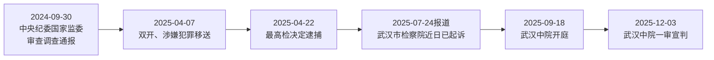

# 第7章　监察、检察和法院，各自管哪一段？

*《中国政治是怎么运转的》· 初稿 v0.1*  
*事实截止：2026年9月29日。*

2025年12月3日，湖北省武汉市中级人民法院公布一项一审判决：中央纪委国家监委驻中央组织部纪检监察组原组长李刚犯受贿罪，获刑十五年，并处罚金六百万元。法院的消息还说，案件在9月18日公开开庭；庭上，检察机关出示证据，李刚和辩护人质证，双方发表意见，李刚作最后陈述。[^1]

如果你只读这条判决新闻，故事似乎已经有了结尾。但把时钟往前拨，会看见另外几条标题：李刚“接受纪律审查和监察调查”，“被开除党籍和公职”，“被决定逮捕”，“被提起公诉”。同一个人，为什么有这么多不同机关出场？它们是不是在轮流宣布同一件事？

不是。每条消息都把案件向前推了一步，也各自停在不同的位置。这章只跟这一条案件链走，不急于把反腐败制度的每一道内部手续全部展开。我们要辨认的是：**谁在调查，谁决定是否起诉，谁把指控拿到法庭，谁有权作出刑事判决。**

先记住一件简单的事：新闻标题里的动词不是可以互换的进度条。“接受调查”回答谁正在查；“移送”回答材料交到哪里；“决定逮捕”涉及一项刑事强制措施；“提起公诉”是把指控提交法院；“判决”才是审判机关对罪责作出裁断。即使后来出现一审有罪判决，读回此前的新闻，也不能把每个“涉嫌”改写成当时已经定罪。人的处境会随程序变化，机关说话的身份与权力却不能倒着改。

先把最重要的界限放在眼前：本章在回溯早期通报时，只按通报当时的措辞说“涉嫌”；提到受贿事实与罪名时，才引用法院后来的一审认定。公开的法院消息是对判决的正式报道，并非判决书全文；它没有展示全部证据，也没有说明一审之后是否上诉。[^1]

## 第一站：一个纪检监察干部接受审查调查

2024年9月30日，中央纪委国家监委网站发出一则很短的消息。李刚当时的职务是中央纪委国家监委驻中央组织部纪检监察组组长，因涉嫌严重违纪违法，正接受中央纪委国家监委纪律审查和监察调查。短短一句，已经包含三个值得停下来的地方。[^2]

第一，他的工作原本就与纪检监察有关。但在这条消息里，李刚是被审查调查的人，不是主持调查的人。不能因为名字前有“纪检监察组组长”，就把他的岗位与作出通报的机关混成一处。

第二，通报把“纪律审查”和“监察调查”并排写。党的纪律检查委员会与同级监察委员会合署办公，一套工作机构使用两个机关名称、履行两项职责。纪委依据党章党规党纪处理党内纪律问题；监委是国家监察机关，依法监督、调查公职人员职务违法和职务犯罪。两项职责会衔接，但“违纪”和“犯罪”不是同一个判断。[^3]

第三，通报说的是“涉嫌”。它确认审查调查已发生，没有宣告李刚犯受贿罪。读者可以据此追问，监察调查之后若发现涉嫌犯罪，会怎样进入刑事程序；不能把自己对案件的判断提前写成法院结论。

当时有效的《监察法》是2018年通过的版本。它规定，监察委员会是行使国家监察职能的专责机关，可以调查职务违法和职务犯罪；对涉嫌职务犯罪，经调查认为事实清楚、证据确实充分的，制作起诉意见书，连同案卷与证据移送人民检察院审查。它也要求调查既收集有罪、罪重材料，也收集有无违法犯罪及情节轻重的证据，禁止以非法方法取证。法律提供的是职责与要求，不是我们已经看见李刚案每份证据的保证书。[^4]

这一点尤其要记住，因为2025年6月1日起，修订后的《监察法》施行。本案9月受调查、次年4月移送发生在此之前，不能拿修订版中新设或改写的措施，倒述2024年的调查活动。后面的刑事审查和审判则发生在修法生效之后，但检察、法院各自的工作还须按当时有效的刑事诉讼法来理解。[^5]

## “双开”以后，为什么还要移送？

2025年4月7日，中央纪委国家监委网站发布第二份通报：李刚被开除党籍、开除公职；其涉嫌犯罪问题移送检察机关依法审查起诉，所涉财物一并移送。通报说明，这是经过审查调查之后，对党纪、政务和涉嫌犯罪问题分别作出的处理与衔接。[^6]

“双开”常被当成一句熟悉的新闻套语，实际上包含两种不同性质的处理。开除党籍，处理的是党员身份和党内纪律；开除公职，处理的是公职身份。它们都很严重，却不是法院判刑的别称。刑事责任能否成立、成立何种罪名以及判什么刑，仍要走后面的检察与审判程序。[^3][^4]

同一份通报里，先写违纪违法问题，再写涉嫌犯罪移送，容易让人以为前一段已经把后一段证明完了。其实纪律处分、政务处分与刑事追诉各有依据和后果。它们可能围绕同一批行为展开，但不能用“被开除公职”代替“被法院认定有罪”，也不能据此猜测后来法庭采信了哪些具体证据。把它们拆开，才看得清4月7日公告的信息量：纪律和公职身份上的处理已经公布，刑事案件则进入另一个机关的审查范围。[^6][^7]

注意通报最后的“移送”。这不是把已判决的罪犯交给下一机关执行刑罚，而是把涉嫌职务犯罪的案件材料送给检察机关审查。检察院并非只负责给监察机关的结论盖章。2018年修正的《刑事诉讼法》规定，凡需要提起公诉的案件由检察院审查决定；对监察机关移送的案件，检察院可以在需要补充核实时退回补充调查，必要时自行补充侦查；它还必须核查事实、证据、罪名及是否属于不应追究刑事责任的情形。[^7]

移送本身没有告诉我们检察院最后会起诉，也没有告诉我们辩护人会提出什么意见。说“案件进入审查起诉”，比说“已经由司法机关定罪”慢半拍，正因为这半拍里有独立的工作和法定选择。

4月22日，最高人民检察院公布：李刚涉嫌受贿案由国家监察委员会调查终结、移送检察机关审查起诉；最高检依法以涉嫌受贿罪对他作出**逮捕决定**。这里又出现一个容易被读快的词。逮捕是刑事诉讼中的强制措施，针对程序中的犯罪嫌疑人；它不等于起诉，更不等于判决。最高检公告最后写的仍是“该案正在进一步办理中”。[^8]

新闻没有披露此前是否采取过留置等具体调查措施，所以不能替李刚案补一段“先留置、再逮捕”的细节。法律确实规定了留置与刑事强制措施怎样衔接，但**一条法律允许某种措施，不等于这宗案件的公开材料已经证明它被使用**。这一层区别也留待第14章再细说。[^4][^7]

## 从“审查”到“指控”，检察院做了什么

2025年7月24日，最高检网站发布起诉消息。它说，国家监委调查终结后，经最高检指定，由湖北省武汉市人民检察院审查起诉；“近日”，武汉市人民检察院已向武汉市中级人民法院提起公诉。这里能确定报道刊发日是7月24日，实际提起公诉的具体日期却没有给出，不能擅自把两者写成同一天。[^9]

为何由武汉市检察院办理，而李刚过去的任职地点多在四川、云南？公开报道给出了“经最高检指定”这个程序事实，没有说明指定的个案理由。可以确认指定管辖及承办机关，不能凭地图、人物经历推导出没有公开的考虑。

再看消息第二段。检察机关说，审查起诉阶段已经告知李刚诉讼权利，讯问了他，听取了辩护人意见；并以受贿罪向法院提出指控。这个动作与4月22日的逮捕决定不同：经过审查，检察院决定把案件作为公诉案件交给法院，请求法院审理。新闻称“起诉指控”，并不等于法院已经采纳指控。[^9]

如果把起诉书想成一张“法庭入场券”，就容易明白两院的界线。检察院需要拿出事实、证据和法律上的主张；法院要在诉讼中审查这些主张、听取控辩意见，最后作出裁判。2018年修正的《刑事诉讼法》明确，检察院认为犯罪事实已查清、证据确实充分、依法应追究刑事责任的，才应作出起诉决定；法院定罪则是再下一步。法律还规定，未经人民法院依法判决，对任何人都不得确定有罪。[^7]

这里有一个阅读公告的办法：把“谁说的”与“说到了哪一步”一起圈出来。最高检网站刊出起诉消息，不意味着最高检成了审判机关；武汉市检察院提出受贿罪指控，不意味着武汉市中院已经判了受贿罪。反过来，法院后来认定有罪，也不能把检方原本需要提出和证明的主张从程序中抹去。控诉与审判必须能在文本里分辨，法庭上才谈得上对指控进行质证、辩论和裁断。[^7][^9][^1]

这不意味着检察机关只会提起刑事公诉。人民检察院组织法称它为国家的法律监督机关，职责还包括对诉讼活动、判决裁定执行等依法监督。2026年，最高检检察长应勇也在公开文章中谈“强化检察监督”。但在李刚案这条新闻里，我们抓住最直接的动作就够了：武汉市检察院审查案件、提起公诉。应勇是帮助我们认清2026年最高检位置的人，公开资料没有说他亲自办理了本案。[^10]

## 到了法庭，“指控”如何变成“判决”

最高法院网站后来披露，武汉市中级人民法院于2025年9月18日公开开庭。检察机关举证，李刚及辩护人质证，控辩双方在法庭主持下发表意见，李刚作最后陈述。这几项动作值得逐个看：检察官提出证据和指控，不是替法官宣判；辩护人参与质证，不是新闻里的陪衬；法庭听完各方意见，也还没有走到宣布结果那一刻。[^1]

12月3日，法院才公布一审判决。法院称经审理查明，李刚在相关任职期间利用职务便利以及职权、地位形成的便利条件，为他人在企业经营、项目承揽等方面提供帮助，收受财物折合人民币1.02亿余元；法院认定其行为构成受贿罪，判处有期徒刑十五年，并处罚金六百万元。这里“法院查明”与7月“检察机关指控”不再是同一层措辞。正文只在此处以法院的正式消息转述犯罪事实，且不把新闻摘要伪装成判决书全文。[^1]

庭审报道没有逐件列出证据，也没有把控辩双方的完整发言收入新闻。我们能确认的是公开庭审曾举行，检方举证、被告人与辩护人质证，并且法院最后公布了它的事实认定和处罚。若要进一步判断某一笔财物的证据如何形成、某一项辩护意见为什么未被采纳，仅凭这条消息办不到。程序图能告诉我们案件到了哪里，不能替代判决书和庭审材料完成细读。[^1]

量刑也显示法院的工作不是复述起诉意见。法院消息列出重大立功、部分受贿未遂、到案后供述、认罪悔罪和退赃等因素，说明依法减轻处罚。读者不必在本章计算每项因素对应多少年刑期，但应看见法院不仅回答“构不构罪”，还要按法律评价情节与处罚。[^1]

人民法院是国家审判机关。2018年修订的人民法院组织法这样定位它；刑事诉讼法要求法院在事实清楚、证据确实充分、依法认定有罪时作有罪判决，证据不足、不能认定有罪时应作无罪判决。法院与检察院名称只差一个词，却不是检察院起诉后自动印出判刑结果的两个柜台。[^11]

一审判决还有一个时间上的边界。刑事诉讼法给不服一审判决的被告人上诉权，也规定检察院认为一审裁判确有错误时可以抗诉；不服判决的上诉、抗诉期限，从收到判决书或裁定书的次日起算。我们检索到的是法院正式发布的**一审宣判消息**，没有取得李刚案公开的二审或生效证明。因此，本章说“一审判处十五年”，不额外写“判决已经终审生效”。[^12]

2026年的最高人民法院院长是张军。他曾于2018年当选最高人民检察院检察长，2023年当选最高人民法院院长；到2026年，最高法报道仍以院长介绍他。一位人物先后出现在两个机关，不会让两个机关拥有相同职责。更不能因为张军是最高法院院长，就把武汉中院的一审判决写成他个人作出的判决。人物帮助我们辨认位置，具体办案仍要看实际承办机关。[^13]

## 公安机关在哪里？

讲到刑事案件，很多人第一反应是“警察抓人”。这个印象来自大量普通刑事案件：公安机关依法侦查，随后移送检察院审查起诉，再由法院审判。但李刚案公开材料写的调查者是国家监委；把一般路径不经查证就套到这宗职务犯罪案，反而会错。[^4][^7][^9]

刑事诉讼法确有一般的分工规则：刑事案件侦查由公安机关进行，法律另有规定的除外；监察机关移送的职务犯罪案则依监察法与刑事诉讼法衔接。公安机关也可能依法律协助监察机关、执行逮捕决定等，但这不意味着它在所有职务犯罪案中负责主要调查。本案几条公开消息没有交代公安机关参与了哪些具体动作，我们就不要为它添上一格“公安破案”。[^4][^7]

区别不靠机关名字里有没有“警”“检”“法”来背，而靠案由、法定职责和公开材料。看到一般刑案中的“公安侦查”，不要直接推论所有犯罪都从公安开始；看到职务犯罪案中的“监委调查”，也不要推论公安机关在任何衔接环节都绝不会出现。公开材料没有交代的具体动作，正是判断应该停住的地方。[^4][^7]

同理，也别把检察院读成只管“抓坏人”，把法院读成只管“判刑”。检察院有法律监督职能，法院也审理民事、行政等案件。本章选的是一宗已经公开一审结果的受贿案，画出的只是这类案件的刑事程序主线。遇到普通盗窃、民事合同纠纷或行政诉讼，入口和路径可能不同。[^10][^11]

现在把李刚案的公开节点排成一张小图，日期仍按原消息能确定的精度标注：

图上的箭头表示公开材料确认的程序先后，不是说前一个机关的判断自动变成后一个机关的结论。纪委监委通报的“涉嫌”，到检察院成为“起诉指控”，再到法院的一审“经审理查明”，用语一变，作出判断的机关和证据门槛也在变。图里没有画出所有法律允许的分支，更没有画未公开的内部讨论。[^2][^6][^8][^9][^1]

## 规则能说明什么，材料还缺什么

回顾这一年多的新闻，最容易得到的是一条整齐的时间线；最不该得到的是仿佛看过全部案卷的自信。调查通报没有列证据，检察公告概述了审查动作和指控，法院新闻概述了庭审与判决。它们足以帮助我们分清机关、职能和公开进度；不足以独立核对每份证据的来源、每一项辩护意见的内容，以及法庭如何逐项说理。完整判决书若日后公开，能够回答更多问题；目前的正文只写可核的范围。[^1][^2][^9]

制度条文又提供另一种信息。它告诉我们检察院应当审查事实、证据并听取辩护意见，法院应当在法庭上审查指控，被告人享有辩护与上诉权。这些规定是衡量程序的尺，不应自动变成“本案每个细节已经证实合规”的评价。要作那种评价，仍需更细的个案材料。[^7][^11][^12]

几位人物也各守自己的位置。李刚是这宗案件的被调查人、犯罪嫌疑人、被告人，最后是获一审判决的人；词随程序而变。应勇、张军分别让我们认出2026年最高检与最高法的现任负责人，但李刚案公开资料只指明国家监委、武汉市检察院和武汉市中级法院各自办理的环节。一个机构的全国负责人，不能被写成每件地方案件的亲自承办人。[^1][^8][^9][^10][^13]

## 新闻重读：看到“提起公诉”，该停在哪里？

请重读最高检2025年7月24日关于李刚案的报道。它写明“国家监察委员会调查终结”“经最高人民检察院指定”“武汉市人民检察院已提起公诉”，还概述了检察机关的起诉指控。[^9]

1. 这时哪一个机关完成了职务犯罪调查？哪一个机关正在以公诉人身份向法院提出主张？
2. “最高检指定”是否等于最高检亲自开庭，或者说明为何选武汉？
3. 若新闻只写到7月，你能否断言李刚犯受贿罪、已被判十五年？要补看哪一条后来的消息？
4. 4月的“决定逮捕”和7月的“提起公诉”为什么不能合并成一个动作？

**参考解释**

第一题，国家监委完成调查并移送，武汉市检察院经指定审查起诉、向武汉市中院提起公诉。第二题，都不能；报道只证实指定管辖的事实，既没有写最高检工作人员出庭，也没有说明指定理由。第三题，不能；7月仍是检方指控，要看12月3日武汉中院的一审宣判消息，才能转述法院的犯罪认定和刑罚，且仍须标明“一审”。第四题，逮捕是刑事强制措施决定，起诉是经审查后把指控交由法院审理；前者不能替代后者，也不能替代法院判决。[^8][^9][^1][^12]

读案件新闻时，不妨先遮住人名，只看动词和发布机关。等“调查”“移送”“逮捕”“起诉”“审判”各有了位置，再把人放回去。一条案件链，便不再像五次宣布同一个结论。

---

## 注释与资料

[^1]: 最高人民法院网站，人民法院新闻传媒总社[《中央纪委国家监委驻中央组织部纪检监察组原组长李刚受贿案一审宣判》](https://www.court.gov.cn/zixun/xiangqing/483051.html)，2025年12月3日。第1段为一审结果，第2—3段为法院查明、量刑理由，末段回述9月18日庭审。来源是法院正式判决消息，非判决书全文；本章没有据它推定二审、生效或全部庭审记录。

[^2]: 中央纪委国家监委网站[《中央纪委国家监委驻中央组织部纪检监察组组长李刚接受中央纪委国家监委纪律审查和监察调查》](https://www.ccdi.gov.cn/toutiaon/202409/t20240930_379028.html)，2024年9月30日。通报只称涉嫌严重违纪违法及接受审查调查，没有刑事定罪表述。

[^3]: 中央纪委国家监委网站[《纪法百科丨合署办公》](https://www.ccdi.gov.cn/specialn/jfbk/jjctjfbk/202411/t20241126_390355.html)，2024年11月26日，说明纪委与监委合署办公、一套工作机构履行党的纪律检查与国家监察两项职责；并引《中国共产党纪律检查委员会工作条例》第七条。中央纪委国家监委同一机关名称在个案中出现，不使党纪处理与国家刑事判决混为一体。

[^4]: [《中华人民共和国监察法》2018年原版全文](https://www.court.gov.cn/zixun/xiangqing/87252.html)，最高人民法院网站转载受权发布文本，2018年3月20日通过、公布施行。第三条界定监察机关，第十五条涉及监察对象，第三十三、三十四条涉及证据和其他机关线索移送，第四十条涉及取证要求，第四十五条第四项规定涉嫌职务犯罪的案件材料移送检察院，第四十七条规定检察机关后续审查。2024年9月至2025年4月的案例节点按此版本解释；正文不假定本案使用留置或公安协助。

[^5]: 全国人大常委会[《关于修改〈中华人民共和国监察法〉的决定》](https://www.npc.gov.cn/c2/c30834/202412/t20241225_442049.html)，2024年12月25日通过，2025年6月1日起施行；2024年监察调查通报与2025年4月移送、逮捕均在修法生效前。另见[修订后全文](https://www.npc.gov.cn/WZWSREL25wYy8vYzIvYzMwODM0LzIwMjUwMi90MjAyNTAyMDVfNDQyNjc2Lmh0bWw%3D)。

[^6]: 中央纪委国家监委网站[《中央纪委国家监委驻中央组织部纪检监察组原组长李刚严重违纪违法被开除党籍和公职》](https://www.ccdi.gov.cn/toutiaon/202504/t20250407_415545.html)，2025年4月7日。末段分别记载开除党籍、国家监委开除公职及涉嫌犯罪问题移送检察机关依法审查起诉；正文未将通报中的纪律定性扩张为刑事判决事实。

[^7]: [《中华人民共和国刑事诉讼法》2018年修正版](https://www.spp.gov.cn/spp/zdgz/201810/t20181027_396818.shtml)，最高人民检察院网站刊载。第十二条“未经人民法院依法判决”原则，第十九条一般侦查管辖，第八十条逮捕执行，第一百六十九至一百七十六条关于监察案件移送、审查起诉、讯问及听取意见、起诉决定，第二百条法院判决条件。本文只用当时有效的2018年修正版解释2025年刑事诉讼阶段。

[^8]: 最高人民检察院[《最高人民检察院依法对李刚决定逮捕》](https://www.spp.gov.cn/spp/yzjcrd/202504/t20250422_694324.shtml)，2025年4月22日。标题与正文均为“决定逮捕”，不是“提起公诉”或“判决”。公告未给出决定作出的精确日期，也未披露先前监察措施。

[^9]: 最高人民检察院[《湖北检察机关依法对李刚涉嫌受贿案提起公诉》](https://www.spp.gov.cn/spp/yzjcrd/202507/t20250724_702438.shtml)，网站时间2025年7月24日；正文“近日”而未写具体起诉日。首段记国家监委调查终结、最高检指定、武汉市检察院向武汉市中院起诉；第二段记告知权利、讯问、听取辩护人意见及检方指控。正文把“指控”与法院认定严格分开。

[^10]: [《中华人民共和国人民检察院组织法》](https://www.spp.gov.cn/spp/fl/201810/t20181026_396824.shtml)，2018年修订，第二条定位法律监督机关；最高检刊载应勇2026年7月[《强化检察监督 履行好国家法律监督机关职责》](https://www.spp.gov.cn/tt/202607/t20260703_731215.shtml)，文首确认其检察长身份。报道用于现实职位与机关职责，不作为其承办李刚案的证据。

[^11]: [《中华人民共和国人民法院组织法》](https://xzfy.moj.gov.cn/c/2021-01-06/487594.shtml)，2018年修订、自2019年1月1日起施行，第二条规定法院为国家审判机关；刑事诉讼法第二百条规定有罪与证据不足时的不同判决条件，链接见注7。李刚案具体法院为武汉市中级人民法院，见注1。

[^12]: 刑事诉讼法第二百二十七至二百三十条，分别规定上诉、抗诉和期限；原文链接见注7。最高法院消息只称“一审公开宣判”，因此正文不写终审或生效状态。

[^13]: 新华社[《张军当选为最高人民检察院检察长》](https://www.court.gov.cn/zixun/xiangqing/86012.html)，2018年3月18日；新华社刊于最高检网站的[《最高人民法院院长简历》](https://www.spp.gov.cn/spp/tt/202303/t20230312_607870.shtml)，2023年3月，确认张军当选最高法院长；最高法院2026年8月28日[报道](https://www.court.gov.cn/zixun/xiangqing/510041.html)仍明确其院长身份。应勇2026年身份见注10。两人均未被本案公开材料列为承办人。
